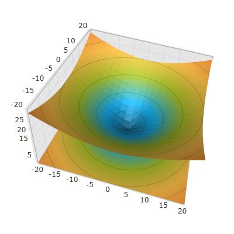
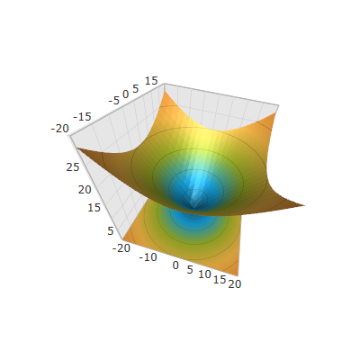

////

|metadata|
{
    "name": "surfacechart-aspect-perspective",
    "controlName": ["{SurfaceChartName}"],
    "tags": [],
    "guid": "5d723aa8-4c79-4f8d-9168-1d01482e97b7",  
    "buildFlags": ["wpf"],
    "createdOn": "2016-02-29T13:45:09.1339267Z"
}
|metadata|
////

= Aspect and Perspective

== Topic Overview

=== Purpose

This topic explains how to configure the aspect and perspective of the link:{SurfaceChartLink}.xamscattersurface3d_members.html[XamScatterSurface3D]™ control.

=== Required background

The following topics are prerequisites to understanding this topic:

[options="header", cols="a,a"]
|====
|Topic|Purpose

| link:surfacechart-getting-started-with-surfacechart.html[Adding xamScatterSurface3D To Your Page]
|This topic provides detailed instructions to help you get up and running as soon as possible with the _xamScatterSurface3D_™ control.

| link:surfacechart-features-overview.html[Features Overview]
|This topic explains the features supported by the control from developer perspective.

| link:surfacechart-visual-elements.html[Visual Elements]
|This topic provides an overview of the visual elements of the control.

|====

=== In this topic

This topic contains the following sections:

* <<_Ref443581289, Configuring Aspect >>
* <<_Ref443581293, Configuring Perspective >>
* <<_Ref443581298, Related Content >>

** <<_Ref443581302,Topics>>
** <<_Ref443581306,Samples>>

[[_Ref443581289]]
== Configuring Aspect

=== Overview

Use the link:{SurfaceChartLink}.xamscattersurface3d_members.html[XamScatterSurface3D] link:{SurfaceChartLink}.xamchart3d~aspect.html[Aspect] property to configure the aspect of the  _xamScatterSurface3D_   control.

=== Property settings

The following table maps the desired configuration to the property settings that manage it.

[options="header", cols="a,a,a"]
|====
|In order to:|Use this property:|And set it to:

|Configure the aspect of the _xamScatterSurface3D_ control
| link:{SurfaceChartLink}.xamchart3d~aspect.html[Aspect]
|`Vector3D`

|====

=== Example

The screenshot below demonstrates how the  _xamScatterSurface3D_   looks as a result of the following code:

Following is the code that implements this example.

*In XAML:*

[source,xaml]
----
<ig:XamScatterSurface3D Name="SurfaceChart" 
 ItemsSource="{Binding Path=DataCollection}" 
 XMemberPath="X" YMemberPath="Y" ZMemberPath="Z" 
 Aspect="1 1 0.5" />
----

Following is the code that implements this example in C#.

*In C#:*

[source,csharp]
----
SurfaceChart.Aspect = new System.Windows.Media.Media3D.Vector3D(1, 1, 0.5);
----

Following is the code that implements this example in VB.

*In Visual Basic:*

[source,vb]
----
SurfaceChart.Aspect = New System.Windows.Media.Media3D.Vector3D(1, 1, 0.5)
----

[[_Ref443581293]]
== Configuring Perspective

=== Overview

Use the link:{SurfaceChartLink}.xamscattersurface3d_members.html[XamScatterSurface3D] link:{SurfaceChartLink}.xamchart3d~perspective.html[Perspective] property to configure the perspective of the  _xamScatterSurface3D_   control.

By default, the initial value of the `Perspective` property is 0.5.

=== Property settings

The following table maps the desired configuration to the property settings that manage it.

[options="header", cols="a,a,a"]
|====
|In order to:|Use this property:|And set it to:

|Configure the perspective of the _xamScatterSurface3D_ control
| link:{SurfaceChartLink}.xamchart3d~perspective.html[Perspective]
|`double`

|====

=== Example

The screenshot below demonstrates how the  _xamScatterSurface3D_   looks as a result of the following code:

Following is the code that implements this example.

*In XAML:*

[source,xaml]
----
<ig:XamScatterSurface3D Name="SurfaceChart" ItemsSource="{Binding Path=DataCollection}" XMemberPath="X" YMemberPath="Y" ZMemberPath="Z" Perspective="1"/>
----

Following is the code that implements this example.

*In C#:*

[source,csharp]
----
SurfaceChart.Perspective = 1;
----

Following is the code that implements this example.

*In Visual Basic:*

[source,vb]
----
SurfaceChart.Perspective = 1
----

[[_Ref443581298]]
== Related Content

[[_Ref443581302]]

=== Topics

The following topics provide additional information related to this topic.

[options="header", cols="a,a"]
|====
|Topic|Purpose

| link:surfacechart-axis.html[Axis Settings]
|The topics in this group explain how to configure different axis settings in the _xamScatterSurface3D_ control.

| link:surfacechart-crosshairs.html[Crosshairs Settings]
|This topic explains how to configure to the crosshairs in the _xamScatterSurface3D_ control.

| link:surfacechart-cube.html[Cube Settings]
|This topic explains how to configure the rim thickness and the material of the cube of the _xamScatterSurface3D_ control.

| link:surfacechart-data-point-marker.html[Data Point Markers]
|The topics in this group explain how to configure the data point markers in the _xamScatterSurface3D_ control.

| link:surfacechart-floor.html[Floor Settings]
|This topic explains how to configure the floor settings of the _xamScatterSurface3D_ control.

| link:surfacechart-performance.html[Performance]
|This topic explains how the _xamScatterSurface3D_ control performance can be optimized when rendering a large set of data points.

| link:surfacechart-rotation.html[Rotation]
|This topic explains how to configure the _xamScatterSurface3D_ control rotation using code.

| link:surfacechart-series.html[Series Settings]
|The topics in this group explain how to configure different series settings in the _xamScatterSurface3D_ control.

| link:surfacechart-tooltip.html[Tooltip]
|This topic explains how to show/hide the default tooltip and how apply a custom tooltip using DataTemplate in the _xamScatterSurface3D_ control.

| link:surfacechart-zooming.html[Zooming]
|This topic explains how to perform the scaling of the _xamScatterSurface3D_ control.

|====

[[_Ref443581306]]

=== Samples

The following sample provides additional information related to this topic.

[options="header", cols="a,a"]
|====
|Sample|Purpose

| link:{SamplesURL}/surface-chart/aspect-perspective-sample[Aspect and Perspective]
|This sample demonstrates how to configure the aspect and perspective settings of the _xamScatterSurface3D_ control.

|====