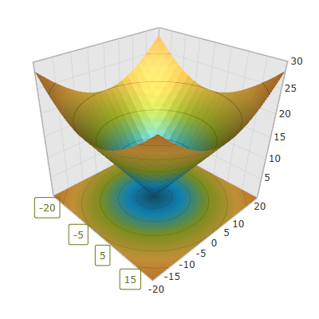

////
|metadata|
{
    "name": "surfacechart-axis-label-templating",
    "controlName": ["{SurfaceChartName}"],
    "tags": [],
    "guid": "da526b97-3307-489e-8fdc-c6c77c165c9d",
    "buildFlags": ["wpf"],
    "createdOn": "2016-03-02T12:16:01.0422085Z"
}
|metadata|
////

= Axis Label Templating

== Topic Overview

=== Purpose

This topic explains how to re-template the axis label in the link:{SurfaceChartLink}.xamscattersurface3d_members.html[XamScatterSurface3D]™ control.

=== Required background

The following topics are prerequisites to understanding this topic:

[options="header", cols="a,a"]
|====
|Topic|Purpose

| link:surfacechart-getting-started-with-surfacechart.html[Adding xamScatterSurface3D To Your Page]
|This topic provides detailed instructions to help you get up and running as soon as possible with the _xamScatterSurface3D_™ control.

| link:surfacechart-features-overview.html[Features Overview]
|This topic explains the features supported by the control from developer perspective.

| link:surfacechart-visual-elements.html[Visual Elements]
|This topic provides an overview of the visual elements of the control.

|====

=== In this topic

This topic contains the following sections:

* <<_Ref443385661, Re-templating Axis Label >>
* <<_Ref443553290, Related Content >>

** <<_Ref443553295,Topics>>
** <<_Ref443553298,Samples>>

[[_Ref443385661]]
== Re-templating Axis Label

=== Overview

Use the link:{SurfaceChartLink}.surfacechartaxis.html[SurfaceChartAxis] link:{SurfaceChartLink}.surfacechartaxis~labeltemplate.html[LabelTemplate] property to re-template the axis label in the  _xamScatterSurface3D_   control.

=== Property settings

The following table maps the desired configuration to the property settings that manage it.

[options="header", cols="a,a,a"]
|====
|In order to:|Use this property:|And set it to:

|Re-template the axis label
| link:{SurfaceChartLink}.surfacechartaxis~labeltemplate.html[LabelTemplate]
|`DataTemplate`

|====

=== Example

The screenshot below demonstrates how the axis label looks as a result of the following settings:

[options="header", cols="a,a"]
|====
|Property|Value

| link:{SurfaceChartLink}.surfacechartaxis~labeltemplate.html[LabelTemplate]
|

[source,xaml]
---- 
<DataTemplate x:Key="LabelDataTemplate">
    <Border BorderThickness="1"
            BorderBrush="#FF68761A"
            CornerRadius="2">
        <Label Content="{Binding}"
               Foreground="#FF68761A"/>
    </Border>
</DataTemplate>
---- 

|====

Following is the code that implements this example.

*In XAML:*

[source,xaml]
----
<ig:XamScatterSurface3D Name="SurfaceChart"
                        ItemsSource="{Binding Path=DataCollection}"
                        XMemberPath="X"
                        YMemberPath="Y"
                        ZMemberPath="Z">
    <ig:XamScatterSurface3D.Resources>
        <DataTemplate x:Key="LabelDataTemplate">
            <Border BorderThickness="1"
                    BorderBrush="#FF68761A" 
                    CornerRadius="2">
                <Label Content="{Binding}"
                       Foreground="#FF68761A"/>
            </Border>
        </DataTemplate>
    </ig:XamScatterSurface3D.Resources>
    <ig:XamScatterSurface3D.XAxis>
        <ig:LinearAxis LabelTemplate="{StaticResource LabelDataTemplate}"/>
    </ig:XamScatterSurface3D.XAxis>
</ig:XamScatterSurface3D>
----

[[_Ref443553290]]
== Related Content

[[_Ref443553295]]

=== Topics

The following topics provide additional information related to this topic.

[options="header", cols="a,a"]
|====
|Topic|Purpose

| link:surfacechart-configuring-axis-label-color-settings.html[Configuring Axis Label Color Settings]
|This topic explains how to configure the axis label background and foreground brush in the _xamScatterSurface3D_ control.

| link:surfacechart-configuring-axis-label-font-settings.html[Configuring Axis Label Font Settings]
|This topic explains how to configure the axis label font settings in the _xamScatterSurface3D_ control.

| link:surfacechart-configuring-axis-label-format.html[Configuring Axis Label Format]
|This topic explains how to configure the axis label format in the _xamScatterSurface3D_ control.

| link:surfacechart-configuring-axis-label-offset.html[Configuring Axis Label Offset]
|This topic explains how to configure the label offset from its axis in the _xamScatterSurface3D_ control.

| link:surfacechart-configuring-axis-label-visibility-settings.html[Configuring Axis Label Visibility Settings]
|This topic explains how to configure the axis label visibility and opacity in the _xamScatterSurface3D_ control.

|====

[[_Ref443553298]]

=== Samples

The following sample provides additional information related to this topic.

[options="header", cols="a,a"]
|====
|Sample|Purpose

| link:{SamplesURL}/surface-chart/axes-labels-sample[Axes Labels]
|This sample demonstrates how to customize the _xamScatterSurface3D_ control axes labels settings.

|====