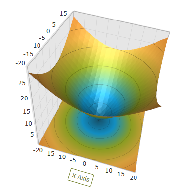

////

|metadata|
{
    "name": "surfacechart-axis-title-templating",
    "controlName": ["{SurfaceChartName}"],
    "tags": [],
    "guid": "d1de312b-a978-4259-a4f6-2d163f01fcce",  
    "buildFlags": ["wpf"],
    "createdOn": "2016-03-01T20:05:33.3689343Z"
}
|metadata|
////

= Axis Title Templating

== Topic Overview

=== Purpose

This topic explains how to re-template the axis title in the link:{SurfaceChartLink}.xamscattersurface3d_members.html[XamScatterSurface3D]™ control.

=== Required background

The following topics are prerequisites to understanding this topic:

[options="header", cols="a,a"]
|====
|Topic|Purpose

| link:surfacechart-getting-started-with-surfacechart.html[Adding xamScatterSurface3D To Your Page]
|This topic provides detailed instructions to help you get up and running as soon as possible with the _xamScatterSurface3D_™ control.

| link:surfacechart-features-overview.html[Features Overview]
|This topic explains the features supported by the control from developer perspective.

| link:surfacechart-visual-elements.html[Visual Elements]
|This topic provides an overview of the visual elements of the control.

|====

=== In this topic

This topic contains the following sections:

* <<_Ref443385790, Axis Title Templating >>
* <<_Ref443421373, Related Content >>

** <<_Ref443421377,Topics>>
** <<_Ref443421381,Samples>>

[[_Ref443385790]]
== Axis Title Templating

=== Overview

Use the link:{SurfaceChartLink}.surfacechartaxis.html[SurfaceChartAxis] link:{SurfaceChartLink}.surfacechartaxis~titletemplate.html[TitleTemplate] property to re-template the axis title.

=== Property settings

The following table maps the desired configuration to the property settings that manage it.

[options="header", cols="a,a,a"]
|====
|In order to:|Use this property:|And set it to:

|Re-template the axis label
| link:{SurfaceChartLink}.surfacechartaxis~titletemplate.html[TitleTemplate]
|`DataTemplate`

|====

=== Example

The screenshot below demonstrates how the axis label looks as a result of the following settings:

[options="header", cols="a,a"]
|====
|Property|Value

| link:{SurfaceChartLink}.surfacechartaxis~titletemplate.html[TitleTemplate]
|

[source,xaml]
---- 
<DataTemplate x:Key="TitleDataTemplate">  <Border BorderThickness="1"  BorderBrush="#FF68761A"  CornerRadius="2">  <Label Content="{Binding}" Foreground="#FF68761A"/>  </Border> </DataTemplate> ---- 

|====

Following is the code that implements this example.

*In XAML:*

[source,xaml]
----
<ig:XamScatterSurface3D Name="SurfaceChart" 
 ItemsSource="{Binding Path=DataCollection}" 
 XMemberPath="X" YMemberPath="Y" ZMemberPath="Z">
    <ig:XamScatterSurface3D.Resources>
        <DataTemplate x:Key="TitleDataTemplate">
            <Border BorderThickness="1" BorderBrush="#FF68761A" CornerRadius="2">
                <Label Content="{Binding}" Foreground="#FF68761A"/>
            </Border>
        </DataTemplate>
    </ig:XamScatterSurface3D.Resources>
    <ig:XamScatterSurface3D.XAxis>
        <ig:LinearAxis Title="X Axis" 
 TitleTemplate="{StaticResource TitleDataTemplate}" />
    </ig:XamScatterSurface3D.XAxis>
</ig:XamScatterSurface3D>
----

[[_Ref443421373]]
== Related Content

[[_Ref443421377]]

=== Topics

The following topics provide additional information related to this topic.

[options="header", cols="a,a"]
|====
|Topic|Purpose

| link:surfacechart-setting-axis-title.html[Setting Axis Title]
|This topic explains how to set axis title in the _xamScatterSurface3D_ control.

| link:surfacechart-configuring-axis-title-color-settings.html[Configuring Axis Title Color Settings]
|This topic explains how to configure the axis title background and foreground brush in the _xamScatterSurface3D_ control.

| link:surfacechart-configuring-axis-title-font-settings.html[Configuring Axis Title Font Settings]
|This topic explains how to configure the axis title font settings in the _xamScatterSurface3D_ control.

| link:surfacechart-configuring-axis-title-offset.html[Configuring Axis Title Offset]
|This topic explains how to configure the title offset from its axis in the _xamScatterSurface3D_ control.

| link:surfacechart-configuring-axis-title-visibility-settings.html[Configuring Axis Title Visibility Settings]
|This topic explains how to configure the axis title visibility and opacity in the _xamScatterSurface3D_ control.

|====

[[_Ref443421381]]

=== Samples

The following sample provides additional information related to this topic.

[options="header", cols="a,a"]
|====
|Sample|Purpose

| link:{SamplesURL}/surface-chart/axes-titles-sample[Axes Titles]
|This sample demonstrates how to customize the _xamScatterSurface3D_ control axes titles settings.

|====