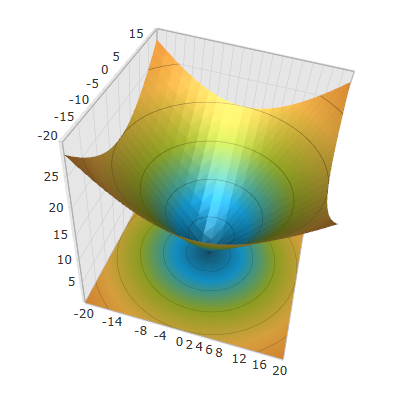

////

|metadata|
{
    "name": "surfacechart-configuring-axis-interval",
    "controlName": ["{SurfaceChartName}"],
    "tags": [],
    "guid": "c3705929-69a6-423f-9e43-d56f17bc4c38",  
    "buildFlags": ["wpf"],
    "createdOn": "2016-02-29T13:32:37.6002112Z"
}
|metadata|
////

= Configuring Axis Interval

== Topic Overview

=== Purpose

This topic explains how to configure the axis interval in the link:{SurfaceChartLink}.xamscattersurface3d_members.html[XamScatterSurface3D]™ control.

=== Required background

The following topics are prerequisites to understanding this topic:

[options="header", cols="a,a"]
|====
|Topic|Purpose

| link:surfacechart-getting-started-with-surfacechart.html[Adding xamScatterSurface3D To Your Page]
|This topic provides detailed instructions to help you get up and running as soon as possible with the _xamScatterSurface3D_™ control.

| link:surfacechart-features-overview.html[Features Overview]
|This topic explains the features supported by the control from developer perspective.

| link:surfacechart-visual-elements.html[Visual Elements]
|This topic provides an overview of the visual elements of the control.

|====

=== In this topic

This topic contains the following sections:

* <<_Ref443660585, Configuring Axis Interval >>
* <<_Ref443660589, Related Content >>

** <<_Ref443660594,Topics>>
** <<_Ref443660599,Samples>>

[[_Ref443660585]]
== Configuring Axis Interval

=== Overview

Use the link:{SurfaceChartLink}.linearaxis.html[LinearAxis] link:{SurfaceChartLink}.linearaxis~interval.html[Interval] property to configure the axis interval in the  _xamScatterSurface3D_   control.

The `Interval` property manages the frequency of the grid lines.

By default, the axes intervals are automatically calculated based on the axes minimum and maximum values.

=== Property settings

The following table maps the desired configuration to the property settings that manage it.

[options="header", cols="a,a,a"]
|====
|In order to:|Use this property:|And set it to:

|Configure the axis interval
| link:{SurfaceChartLink}.linearaxis~interval.html[Interval]
|`double`

|====

=== Example

The screenshot below demonstrates how the  _xamScatterSurface3D_   control X axis looks as a result of the following settings:

[options="header", cols="a,a"]
|====
|Property|Value

| link:{SurfaceChartLink}.linearaxis~interval.html[Interval]
| _2_ 

|====

Following is the code that implements this example.

*In XAML:*

[source,xaml]
----
<ig:XamScatterSurface3D Name="SurfaceChart" 
 ItemsSource="{Binding Path=DataCollection}" 
 XMemberPath="X" YMemberPath="Y" ZMemberPath="Z">
    <ig:XamScatterSurface3D.XAxis>
        <ig:LinearAxis Interval="2"/>
    </ig:XamScatterSurface3D.XAxis>
</ig:XamScatterSurface3D>
----

Following is the code that implements this example in C#.

*In C#:*

[source,csharp]
----
…
var linearAxis = new LinearAxis();
linearAxis.Interval = 2;
SurfaceChart.XAxis = linearAxis;
----

Following is the code that implements this example.

*In Visual Basic:*

[source,vb]
----
…
Dim linearAxis = New LinearAxis()
linearAxis.Interval = 2
SurfaceChart.XAxis = linearAxis
----

[[_Ref443660589]]
== Related Content

[[_Ref443660594]]

=== Topics

The following topics provide additional information related to this topic.

[options="header", cols="a,a"]
|====
|Topic|Purpose

| link:surfacechart-grid-lines.html[Configuring Axis Grid Lines]
|This topic explains how to configure the brush and thickness of the grid lines in the _xamScatterSurface3D_ control.

| link:surfacechart-configuring-axis-label.html[Configuring Axis Label]
|The topics in this group explain how to configure different aspects of the visual representation of the axis label in the _xamScatterSurface3D_ control.

| link:surfacechart-configuring-axis-line.html[Configuring Axis Line]
|This topic explains how to configure the axes lines in the _xamScatterSurface3D_ control.

| link:surfacechart-configuring-axis-range.html[Configuring Axis Range]
|This topic explains how to configure the axis range by setting the MinimumValue and MaximumValue properties in the _xamScatterSurface3D_ control.

| link:surfacechart-configuring-axis-scales.html[Configuring Axis Types]
|This topic explains the axis types available in the _xamScatterSurface3D_ control.

| link:surfacechart-configuring-axis-tick-marks-range.html[Configuring Axis Tick Marks Range]
|This topic explains how to configure the axis tick marks range in the _xamScatterSurface3D_ control.

| link:surfacechart-configuring-axis-title.html[Configuring Axis Title]
|The topics in this group explain how to configure different aspects of the visual representation of the axis title in the _xamScatterSurface3D_ control.

| link:surfacechart-inverting-axis.html[Inverting Axis]
|This topic explains how to invert an axis in the _xamScatterSurface3D_ control.

|====

[[_Ref443660599]]

=== Samples

The following sample provides additional information related to this topic.

[options="header", cols="a,a"]
|====
|Sample|Purpose

| link:{SamplesURL}/surface-chart/plotlines-sample[Plotlines Settings]
|This sample demonstrates how to configure the _xamScatterSurface3D_ grid and axes lines properties as well as line interval and axis inversion.

|====