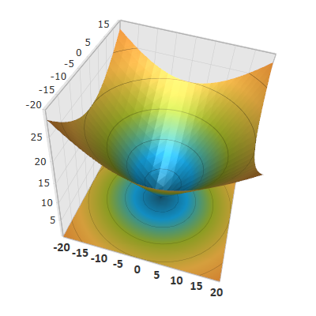

////

|metadata|
{
    "name": "surfacechart-configuring-axis-label-font-settings",
    "controlName": ["{SurfaceChartName}"],
    "tags": [],
    "guid": "e0451edc-6c3a-4277-bc4d-e27e292b9893",  
    "buildFlags": ["wpf"],
    "createdOn": "2016-03-02T12:11:10.9421688Z"
}
|metadata|
////

= Configuring Axis Label Font Settings

== Topic Overview

=== Purpose

This topic explains how to configure the axis label font settings in the link:{SurfaceChartLink}.xamscattersurface3d_members.html[XamScatterSurface3D]™ control.

=== Required background

The following topics are prerequisites to understanding this topic:

[options="header", cols="a,a"]
|====
|Topic|Purpose

| link:surfacechart-getting-started-with-surfacechart.html[Adding xamScatterSurface3D To Your Page]
|This topic provides detailed instructions to help you get up and running as soon as possible with the _xamScatterSurface3D_™ control.

| link:surfacechart-features-overview.html[Features Overview]
|This topic explains the features supported by the control from developer perspective.

| link:surfacechart-visual-elements.html[Visual Elements]
|This topic provides an overview of the visual elements of the control.

|====

=== In this topic

This topic contains the following sections:

* <<_Ref443325755, Configuring Axis Label Font Settings >>
* <<_Ref443497073, Related Content >>

** <<_Ref443497077,Topics>>
** <<_Ref443497081,Samples>>

[[_Ref443325755]]
== Configuring Axis Label Font Settings

=== Overview

Use the link:{SurfaceChartLink}.surfacechartaxis.html[SurfaceChartAxis] link:{SurfaceChartLink}.surfacechartaxis~labelfontfamily.html[LabelFontFamily], link:{SurfaceChartLink}.surfacechartaxis~labelfontsize.html[LabelFontSize] and link:{SurfaceChartLink}.surfacechartaxis~labelfontweight.html[LabelFontWeight] properties to set font family, size and weight to the axis label text.

=== Property settings

The following table maps the desired configuration to the property settings that manage it.

[options="header", cols="a,a,a"]
|====
|In order to:|Use this property:|And set it to:

|Configure the axis label font family
| link:{SurfaceChartLink}.surfacechartaxis~labelfontfamily.html[LabelFontFamily]
|`FontFamily`

|Configure the axis label font size
| link:{SurfaceChartLink}.surfacechartaxis~labelfontsize.html[LabelFontSize]
|`double`

|Configure the axis label font weight
| link:{SurfaceChartLink}.surfacechartaxis~labelfontweight.html[LabelFontWeight]
|`FontWeight`

|====

=== Example

The screenshot below demonstrates how the axis label looks as a result of the following settings:

[options="header", cols="a,a"]
|====
|Property|Value

| link:{SurfaceChartLink}.surfacechartaxis~labelfontfamily.html[LabelFontFamily]
| _Calibri_ 

| link:{SurfaceChartLink}.surfacechartaxis~labelfontsize.html[LabelFontSize]
| _16_ 

| link:{SurfaceChartLink}.surfacechartaxis~labelfontweight.html[LabelFontWeight]
| _Bold_ 

|====

Following is the code that implements this example.

*In XAML:*

[source,xaml]
----
<ig:XamScatterSurface3D Name="SurfaceChart" 
 ItemsSource="{Binding Path=DataCollection}">
    <ig:XamScatterSurface3D.XAxis>
        <ig:LinearAxis 
 LabelFontFamily="Calibri" 
 LabelFontSize="16" 
 LabelFontWeight="Bold" />
    </ig:XamScatterSurface3D.XAxis>
</ig:XamScatterSurface3D>
----

*In C#:*

[source,csharp]
----
…
var linearAxis = new LinearAxis()
{
    LabelFontFamily = new FontFamily("Calibri"),
    LabelFontSize = 16,
    LabelFontWeight = FontWeights.Bold
};
SurfaceChart.XAxis = linearAxis;
----

*In Visual Basic:*

[source,vb]
----
…
Dim linearAxis = New LinearAxis()
linearAxis.LabelFontFamily = New FontFamily("Calibri")
linearAxis.LabelFontSize = 16
linearAxis.LabelFontWeight = FontWeights.Bold
SurfaceChart.XAxis = linearAxis
----

[[_Ref443497073]]
== Related Content

[[_Ref443497077]]

=== Topics

The following topics provide additional information related to this topic.

[options="header", cols="a,a"]
|====
|Topic|Purpose

| link:surfacechart-configuring-axis-label-color-settings.html[Configuring Axis Label Color Settings]
|This topic explains how to configure the axis label background and foreground brush in the _xamScatterSurface3D_ control.

| link:surfacechart-configuring-axis-label-format.html[Configuring Axis Label Format]
|This topic explains how to configure the axis label format in the _xamScatterSurface3D_ control.

| link:surfacechart-configuring-axis-label-offset.html[Configuring Axis Label Offset]
|This topic explains how to configure the label offset from its axis in the _xamScatterSurface3D_ control.

| link:surfacechart-configuring-axis-label-visibility-settings.html[Configuring Axis Label Visibility Settings]
|This topic explains how to configure the axis label visibility and opacity in the _xamScatterSurface3D_ control.

| link:surfacechart-axis-label-templating.html[Axis Label Templating]
|This topic explains how to re-template the axis label in the _xamScatterSurface3D_ control.

|====

[[_Ref443497081]]

=== Samples

The following sample provides additional information related to this topic.

[options="header", cols="a,a"]
|====
|Sample|Purpose

| link:{SamplesURL}/surface-chart/axes-labels-sample[Axes Labels]
|This sample demonstrates how to customize the _xamScatterSurface3D_ control axes labels settings.

|====