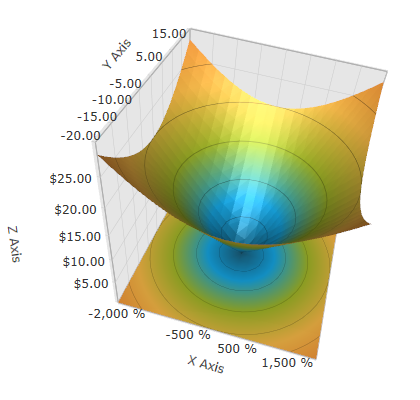

////

|metadata|
{
    "name": "surfacechart-configuring-axis-label-format",
    "controlName": ["{SurfaceChartName}"],
    "tags": [],
    "guid": "fcecd1a6-96da-456e-bf39-83ac136f111c",  
    "buildFlags": ["wpf"],
    "createdOn": "2016-03-02T12:12:21.2034861Z"
}
|metadata|
////

= Configuring Axis Label Format

== Topic Overview

=== Purpose

This topic explains how to configure the axis label format in the link:{SurfaceChartLink}.xamscattersurface3d_members.html[XamScatterSurface3D]™ control.

=== Required background

The following topics are prerequisites to understanding this topic:

[options="header", cols="a,a"]
|====
|Topic|Purpose

| link:surfacechart-getting-started-with-surfacechart.html[Adding xamScatterSurface3D To Your Page]
|This topic provides detailed instructions to help you get up and running as soon as possible with the _xamScatterSurface3D_™ control.

| link:surfacechart-features-overview.html[Features Overview]
|This topic explains the features supported by the control from developer perspective.

| link:surfacechart-visual-elements.html[Visual Elements]
|This topic provides an overview of the visual elements of the control.

|====

The following table lists the online articles required as a prerequisite to understanding this topic.

==== *.NET Framework composite format strings* 

link:http://msdn.microsoft.com/en-us/library/dwhawy9k.aspx[Standard Numeric Format Strings] 

link:http://msdn.microsoft.com/en-us/library/az4se3k1(v=VS.100).aspx[Standard Date and Time Format Strings] 

=== In this topic

This topic contains the following sections:

* <<_Ref443558180, Configuring Axis Label Format >>
* <<_Ref443558185, Related Content >>

** <<_Ref443558189,Topics>>

[[_Ref443558180]]
== Configuring Axis Label Format

=== Overview

Use the link:{SurfaceChartLink}.surfacechartaxis.html[SurfaceChartAxis] link:{SurfaceChartLink}.surfacechartaxis~labelformat.html[LabelFormat] property to format the axis labels in the  _xamScatterSurface3D_   control.

.Note
[NOTE]
====
Curly braces ('{' and '}') in XAML are special characters for markup extensions. If the first value of a string needs to be a curly brace, an empty set of curly braces must be used as an escape sequence. This allows the text following the empty set of curly braces to be taken as a literal value.
====

=== Property settings

The following table maps the desired configuration to the property settings that manage it.

[options="header", cols="a,a,a"]
|====
|In order to:|Use this property:|And set it to:

|Format the axis label
| link:{SurfaceChartLink}.surfacechartaxis~labelformat.html[LabelFormat]
|`string`

|====

=== Example

The screenshot below demonstrates how the axis label looks as a result of the following settings:

[options="header", cols="a,a"]
|====
|Property|Value

|X Axis Label Format
|_{0:P0}_

|Y Axis Label Format
|_{0:N2}_

|Z Axis Label Format
|_{0:C}_

|====

Following is the code that implements this example.

*In XAML:*

[source,xaml]
----
<ig:XamScatterSurface3D Name="SurfaceChart" 
 ItemsSource="{Binding Path=DataCollection}" 
 XMemberPath="X" YMemberPath="Y" ZMemberPath="Z" >
    <ig:XamScatterSurface3D.XAxis>
        <ig:LinearAxis Title="X" LabelFormat="{}{0:P0}"/>
    </ig:XamScatterSurface3D.XAxis>
    <ig:XamScatterSurface3D.YAxis>
        <ig:LinearAxis Title="Y" LabelFormat="{}{0:N2}"/>
    </ig:XamScatterSurface3D.YAxis>
    <ig:XamScatterSurface3D.ZAxis>
        <ig:LinearAxis Title="Z" LabelFormat="{}{0:C}"/>
    </ig:XamScatterSurface3D.ZAxis>
</ig:XamScatterSurface3D>
----

*In C#:*

[source,csharp]
----
…
var linearAxisX = new LinearAxis();
var linearAxisY = new LinearAxis();
var linearAxisZ = new LinearAxis();
linearAxisX.LabelFormat = "{0:P0}";
linearAxisY.LabelFormat = "{0:N2}";
linearAxisZ.LabelFormat = "{0:C}";
SurfaceChart.XAxis = linearAxisX;
SurfaceChart.YAxis = linearAxisY;
SurfaceChart.ZAxis = linearAxisZ;
----

*In Visual Basic:*

[source,vb]
----
…
Dim linearAxisX = New LinearAxis()
Dim linearAxisY = New LinearAxis()
Dim linearAxisZ = New LinearAxis()
linearAxisX.LabelFormat = "{0:P0}"
linearAxisY.LabelFormat = "{0:N2}"
linearAxisZ.LabelFormat = "{0:C}"
SurfaceChart.XAxis = linearAxisX
SurfaceChart.YAxis = linearAxisY
SurfaceChart.ZAxis = linearAxisZ
----

[[_Ref443558185]]
== Related Content

[[_Ref443558189]]

=== Topics

The following topics provide additional information related to this topic.

[options="header", cols="a,a"]
|====
|Topic|Purpose

| link:surfacechart-configuring-axis-label-color-settings.html[Configuring Axis Label Color Settings]
|This topic explains how to configure the axis label background and foreground brush in the _xamScatterSurface3D_ control.

| link:surfacechart-configuring-axis-label-font-settings.html[Configuring Axis Label Font Settings]
|This topic explains how to configure the axis label font settings in the _xamScatterSurface3D_ control.

| link:surfacechart-configuring-axis-label-offset.html[Configuring Axis Label Offset]
|This topic explains how to configure the label offset from its axis in the _xamScatterSurface3D_ control.

| link:surfacechart-configuring-axis-label-visibility-settings.html[Configuring Axis Label Visibility Settings]
|This topic explains how to configure the axis label visibility and opacity in the _xamScatterSurface3D_ control.

| link:surfacechart-axis-label-templating.html[Axis Label Templating]
|This topic explains how to re-template the axis label in the _xamScatterSurface3D_ control.

|====