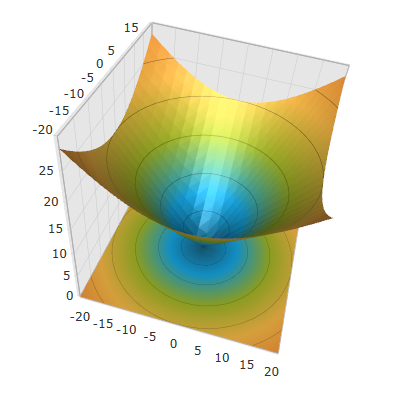

////

|metadata|
{
    "name": "surfacechart-configuring-axis-label-offset",
    "controlName": ["{SurfaceChartName}"],
    "tags": [],
    "guid": "a726b0d2-0ffa-4374-9ea7-960602cfaf36",  
    "buildFlags": ["wpf"],
    "createdOn": "2016-03-02T12:13:36.4673913Z"
}
|metadata|
////

= Configuring Axis Label Offset

== Topic Overview

=== Purpose

This topic explains how to configure the label offset from its axis in the link:{SurfaceChartLink}.xamscattersurface3d_members.html[XamScatterSurface3D]™ control.

=== Required background

The following topics are prerequisites to understanding this topic:

[options="header", cols="a,a"]
|====
|Topic|Purpose

| link:surfacechart-getting-started-with-surfacechart.html[Adding xamScatterSurface3D To Your Page]
|This topic provides detailed instructions to help you get up and running as soon as possible with the _xamScatterSurface3D_™ control.

| link:surfacechart-features-overview.html[Features Overview]
|This topic explains the features supported by the control from developer perspective.

| link:surfacechart-visual-elements.html[Visual Elements]
|This topic provides an overview of the visual elements of the control.

|====

=== In this topic

This topic contains the following sections:

* <<_Ref443326858, Configuring Axis Label Offset >>
* <<_Ref443497478, Related Content >>

** <<_Ref443497482,Topics>>
** <<_Ref443497485,Samples>>

[[_Ref443326858]]
== Configuring Axis Label Offset

=== Overview

Use the link:{SurfaceChartLink}.surfacechartaxis.html[SurfaceChartAxis] link:{SurfaceChartLink}.surfacechartaxis~labeloffset.html[LabelOffset] property to set the label offset from its axis.

=== Property settings

The following table maps the desired configuration to the property settings that manage it.

[options="header", cols="a,a,a"]
|====
|In order to:|Use this property:|And set it to:

|Configure the label offset from its axis
| link:{SurfaceChartLink}.surfacechartaxis~labeloffset.html[LabelOffset]
|`double`

|====

=== Example

The screenshot below demonstrates how the axis label looks as a result of the following settings:

[options="header", cols="a,a"]
|====
|Property|Value

| link:{SurfaceChartLink}.surfacechartaxis~labeloffset.html[LabelOffset]
| _0.1_ 

|====

Following is the code that implements this example.

*In XAML:*

[source,xaml]
----
<ig:XamScatterSurface3D Name="SurfaceChart" 
 ItemsSource="{Binding Path=DataCollection}" 
 XMemberPath="X" YMemberPath="Y" ZMemberPath="Z" >
    <ig:XamScatterSurface3D.XAxis>
        <ig:LinearAxis LabelOffset="0.1" />
    </ig:XamScatterSurface3D.XAxis>
</ig:XamScatterSurface3D>
----

*In C#:*

[source,csharp]
----
…
var linearAxis = new LinearAxis();
linearAxis.LabelOffset = 0.1;
SurfaceChart.XAxis = linearAxis;
----

*In Visual Basic:*

[source,vb]
----
…
Dim linearAxis = New LinearAxis()
linearAxis.LabelOffset = 0.1
SurfaceChart.XAxis = linearAxis
----

[[_Ref443497478]]
== Related Content

[[_Ref443497482]]

=== Topics

The following topics provide additional information related to this topic.

[options="header", cols="a,a"]
|====
|Topic|Purpose

| link:surfacechart-configuring-axis-label-color-settings.html[Configuring Axis Label Color Settings]
|This topic explains how to configure the axis label background and foreground brush in the _xamScatterSurface3D_ control.

| link:surfacechart-configuring-axis-label-font-settings.html[Configuring Axis Label Font Settings]
|This topic explains how to configure the axis label font settings in the _xamScatterSurface3D_ control.

| link:surfacechart-configuring-axis-label-format.html[Configuring Axis Label Format]
|This topic explains how to configure the axis label format in the _xamScatterSurface3D_ control.

| link:surfacechart-configuring-axis-label-visibility-settings.html[Configuring Axis Label Visibility Settings]
|This topic explains how to configure the axis label visibility and opacity in the _xamScatterSurface3D_ control.

| link:surfacechart-axis-label-templating.html[Axis Label Templating]
|This topic explains how to re-template the axis label in the _xamScatterSurface3D_ control.

|====

[[_Ref443497485]]

=== Samples

The following sample provides additional information related to this topic.

[options="header", cols="a,a"]
|====
|Sample|Purpose

| link:{SamplesURL}/surface-chart/axes-labels-sample[Axes Labels]
|This sample demonstrates how to customize the _xamScatterSurface3D_ control axes labels settings.

|====