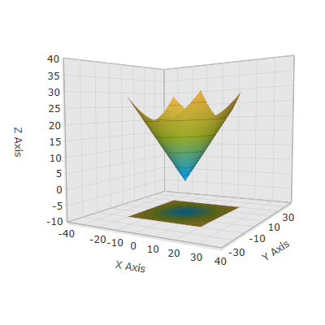

////

|metadata|
{
    "name": "surfacechart-configuring-axis range",
    "controlName": ["{SurfaceChartName}"],
    "tags": [],
    "guid": "64f0086b-4daf-4572-9dd4-15559ad344cf",  
    "buildFlags": ["wpf"],
    "createdOn": "2016-03-01T13:56:48.0755441Z"
}
|metadata|
////

= Configuring Axis Range

== Topic Overview

=== Purpose

This topic explains how to configure the axis range by setting the MinimumValue and MaximumValue properties in the link:{SurfaceChartLink}.xamscattersurface3d_members.html[XamScatterSurface3D]™ control.

=== Required background

The following topics are prerequisites to understanding this topic:

[options="header", cols="a,a"]
|====
|Topic|Purpose

| link:surfacechart-getting-started-with-surfacechart.html[Adding xamScatterSurface3D To Your Page]
|This topic provides detailed instructions to help you get up and running as soon as possible with the _xamScatterSurface3D_™ control.

| link:surfacechart-features-overview.html[Features Overview]
|This topic explains the features supported by the control from developer perspective.

| link:surfacechart-visual-elements.html[Visual Elements]
|This topic provides an overview of the visual elements of the control.

|====

=== In this topic

This topic contains the following sections:

* <<_Ref443657246, Configuring Axis Range >>
* <<_Ref443657250, Related Content >>

** <<_Ref443657255,Topics>>

[[_Ref443657246]]
== Configuring Axis Range

=== Overview

Use the link:{SurfaceChartLink}.linearaxis_members.html[LinearAxis] or link:{SurfaceChartLink}.logarithmicaxis_members.html[LogarithmicAxis] link:{SurfaceChartLink}.linearaxis~minimumvalue.html[MinimumValue] and link:{SurfaceChartLink}.linearaxis~maximumvalue.html[MaximumValue] properties to set the axis range in the  _xamScatterSurface3D_   control.

By default, the minimum and maximum values for the axes ranges are automatically calculated based on the lowest and highest data points.

=== Property settings

The following table maps the desired configuration to the property settings that manage it.

[options="header", cols="a,a,a"]
|====
|In order to:|Use this property:|And set it to:

|Configure the minimum axis value
| link:{SurfaceChartLink}.linearaxis~minimumvalue.html[MinimumValue]
|`double`

|Configure the maximum axis value
| link:{SurfaceChartLink}.linearaxis~maximumvalue.html[MaximumValue]
|`double`

|====

=== Example

The screenshot below demonstrates how the  _xamScatterSurface3D_   control looks as a result of the following code:

Following is the code that implements this example.

*In XAML:*

[source,xaml]
----
<ig:XamScatterSurface3D Name="SurfaceChart" 
 ItemsSource="{Binding Path=DataCollection}" 
 XMemberPath="X" YMemberPath="Y" ZMemberPath="Z">
    <ig:XamScatterSurface3D.XAxis>
        <ig:LinearAxis MinimumValue="-40" 
 MaximumValue="40" 
 Title="X Axis"/>
    </ig:XamScatterSurface3D.XAxis>
    <ig:XamScatterSurface3D.YAxis>
        <ig:LinearAxis MinimumValue="-40" 
 MaximumValue="40" 
 Title="Y Axis" />
    </ig:XamScatterSurface3D.YAxis>
    <ig:XamScatterSurface3D.ZAxis>
        <ig:LinearAxis MinimumValue="-10" 
 MaximumValue="40" 
 Title="Z Axis" />
    </ig:XamScatterSurface3D.ZAxis>
</ig:XamScatterSurface3D>
----

*In C#:*

[source,csharp]
----
…
var xLinearAxis = new LinearAxis();
var yLinearAxis = new LinearAxis();
var zLinearAxis = new LinearAxis();
xLinearAxis.Title = "X Axis";
xLinearAxis.MinimumValue = -40;
xLinearAxis.MaximumValue = 40;
yLinearAxis.Title = "Y Axis";
yLinearAxis.MinimumValue = -40;
yLinearAxis.MaximumValue = 40;
zLinearAxis.Title = "Z Axis";
zLinearAxis.MinimumValue = -10;
zLinearAxis.MaximumValue = 40;
SurfaceChart.XAxis = xLinearAxis;
SurfaceChart.YAxis = yLinearAxis;
SurfaceChart.ZAxis = zLinearAxis;
----

*In Visual Basic:*

[source,vb]
----
…
Dim xLinearAxis = New LinearAxis()
Dim yLinearAxis = New LinearAxis()
Dim zLinearAxis = New LinearAxis()
xLinearAxis.Title = "X Axis"
xLinearAxis.MinimumValue = -40
xLinearAxis.MaximumValue = 40
yLinearAxis.Title = "Y Axis"
yLinearAxis.MinimumValue = -40
yLinearAxis.MaximumValue = 40
zLinearAxis.Title = "Z Axis"
zLinearAxis.MinimumValue = -10
zLinearAxis.MaximumValue = 40
SurfaceChart.XAxis = xLinearAxis
SurfaceChart.YAxis = yLinearAxis
SurfaceChart.ZAxis = zLinearAxis
----

[[_Ref443657250]]
== Related Content

[[_Ref443657255]]

=== Topics

The following topics provide additional information related to this topic.

[options="header", cols="a,a"]
|====
|Topic|Purpose

| link:surfacechart-grid-lines.html[Configuring Axis Grid Lines]
|This topic explains how to configure the brush and thickness of the grid lines in the _xamScatterSurface3D_ control.

| link:surfacechart-configuring-axis-interval.html[Configuring Axis Interval]
|This topic explains how to configure the axis interval in the _xamScatterSurface3D_ control.

| link:surfacechart-configuring-axis-label.html[Configuring Axis Label]
|The topics in this group explain how to configure different aspects of the visual representation of the axis label in the _xamScatterSurface3D_ control.

| link:surfacechart-configuring-axis-line.html[Configuring Axis Line]
|This topic explains how to configure the axes lines in the _xamScatterSurface3D_ control.

| link:surfacechart-configuring-axis-scales.html[Configuring Axis Types]
|This topic explains the axis types available in the _xamScatterSurface3D_ control.

| link:surfacechart-configuring-axis-tick-marks-range.html[Configuring Axis Tick Marks Range]
|This topic explains how to configure the axis tick marks range in the _xamScatterSurface3D_ control.

| link:surfacechart-configuring-axis-title.html[Configuring Axis Title]
|The topics in this group explain how to configure different aspects of the visual representation of the axis title in the _xamScatterSurface3D_ control.

| link:surfacechart-inverting-axis.html[Inverting Axis]
|This topic explains how to invert an axis in the _xamScatterSurface3D_ control.

|====