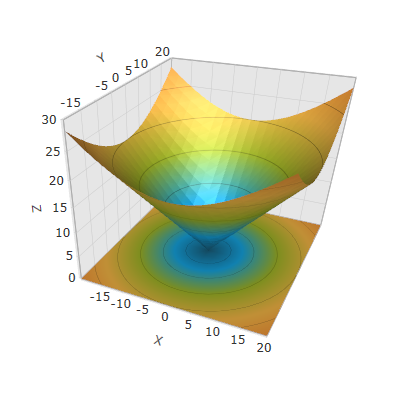
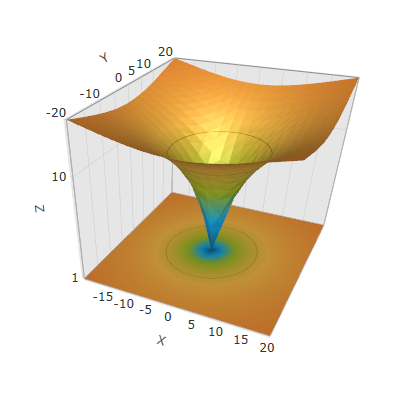
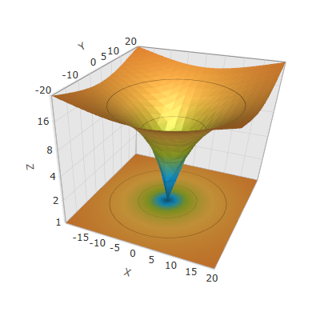

////

|metadata|
{
    "name": "surfacechart-configuring-axis-scales",
    "controlName": ["{SurfaceChartName}"],
    "tags": [],
    "guid": "7b866588-a7c6-4270-84bb-b134e977c351",  
    "buildFlags": ["wpf"],
    "createdOn": "2016-03-01T14:00:08.2699182Z"
}
|metadata|
////

= Configuring Axis Types

== Topic Overview

=== Purpose

This topic explains the axis types available in the link:{SurfaceChartLink}.xamscattersurface3d_members.html[XamScatterSurface3D]™ control.

=== Required background

The following topics are prerequisites to understanding this topic:

[options="header", cols="a,a"]
|====
|Topic|Purpose

| link:surfacechart-getting-started-with-surfacechart.html[Adding xamScatterSurface3D To Your Page]
|This topic provides detailed instructions to help you get up and running as soon as possible with the _xamScatterSurface3D_™ control.

| link:surfacechart-features-overview.html[Features Overview]
|This topic explains the features supported by the control from developer perspective.

| link:surfacechart-visual-elements.html[Visual Elements]
|This topic provides an overview of the visual elements of the control.

|====

=== In this topic

This topic contains the following sections:

* <<_Ref445717634, Configuring Linear Axis >>
* <<_Ref445717639, Configuring Logarithmic Axis >>
* <<_Ref445800007, Configuring Logarithmic Axis Base >>
* <<_Ref445717645, Related Content >>

** <<_Ref445717649,Topics>>

[[_Ref445717634]]
== Configuring Linear Axis

=== Overview

Use link:{SurfaceChartLink}.linearaxis_members.html[LinearAxis] to apply a linear numeric scale in the  _xamScatterSurface3D_   control.

By default, the `LinearAxis` is applied on the data plotted in the  _xamScatterSurface3D_   control.

=== Property settings

The following table maps the desired configuration to the property settings that manage it.

[options="header", cols="a,a,a"]
|====
|In order to:|Use this property:|And set it to:

|Set the X values on a linear number line
| link:{SurfaceChartLink}.xamchart3d~xaxis.html[XAxis]
| link:{SurfaceChartLink}.linearaxis_members.html[LinearAxis]

|Set the Y values on a linear number line
| link:{SurfaceChartLink}.xamchart3d~yaxis.html[YAxis]
| link:{SurfaceChartLink}.linearaxis_members.html[LinearAxis]

|Set the Z values on a linear number line
| link:{SurfaceChartLink}.xamchart3d~zaxis.html[ZAxis]
| link:{SurfaceChartLink}.linearaxis_members.html[LinearAxis]

|====

=== Example

The screenshot below demonstrates how the  _xamScatterSurface3D_   control looks as a result of the following code:

Following is the code that implements this example.

*In XAML:*

[source,xaml]
----
<ig:XamScatterSurface3D Name="SurfaceChart" 
 ItemsSource="{Binding Path=DataCollection}" 
 XMemberPath="X" YMemberPath="Y" ZMemberPath="Z">
    <ig:XamScatterSurface3D.XAxis>
        <ig:LinearAxis Title="X" />
    </ig:XamScatterSurface3D.XAxis>
    <ig:XamScatterSurface3D.YAxis>
        <ig:LinearAxis Title="Y" />
    </ig:XamScatterSurface3D.YAxis>
    <ig:XamScatterSurface3D.ZAxis>
        <ig:LinearAxis Title="Z" />
    </ig:XamScatterSurface3D.ZAxis>
</ig:XamScatterSurface3D>
----

*In C#:*

[source,csharp]
----
…
var xLinearAxis = new LinearAxis();
var yLinearAxis = new LinearAxis();
var zLinearAxis = new LinearAxis();
xLinearAxis.Title = "X";
yLinearAxis.Title = "Y";
zLinearAxis.Title = "Z";
SurfaceChart.XAxis = xLinearAxis;
SurfaceChart.YAxis = yLinearAxis;
SurfaceChart.ZAxis = zLinearAxis;
----

*In Visual Basic:*

[source,vb]
----
…
Dim xLinearAxis = New LinearAxis()
Dim yLinearAxis = New LinearAxis()
Dim zLinearAxis = New LinearAxis()
xLinearAxis.Title = "X"
yLinearAxis.Title = "Y"
zLinearAxis.Title = "Z"
SurfaceChart.XAxis = xLinearAxis
SurfaceChart.YAxis = yLinearAxis
SurfaceChart.ZAxis = zLinearAxis
----

[[_Ref445717639]]
== Configuring Logarithmic Axis

=== Overview

Use link:{SurfaceChartLink}.logarithmicaxis_members.html[LogarithmicAxis] to apply a logarithmic axis in the  _xamScatterSurface3D_   control.

=== Property settings

The following table maps the desired configuration to the property settings that manage it.

[options="header", cols="a,a,a"]
|====
|In order to:|Use this property:|And set it to:

|Set the X values on a logarithmic number line
| link:{SurfaceChartLink}.xamchart3d~xaxis.html[XAxis]
| link:{SurfaceChartLink}.logarithmicaxis_members.html[LogarithmicAxis]

|Set the Y values on a logarithmic number line
| link:{SurfaceChartLink}.xamchart3d~yaxis.html[YAxis]
| link:{SurfaceChartLink}.logarithmicaxis_members.html[LogarithmicAxis]

|Set the Z values on a logarithmic number line
| link:{SurfaceChartLink}.xamchart3d~zaxis.html[ZAxis]
| link:{SurfaceChartLink}.logarithmicaxis_members.html[LogarithmicAxis]

|====

=== Example

The screenshot below demonstrates how the  _xamScatterSurface3D_   control looks as a result of the following code where the ZAxis is set to LogarithmicAxis:

Following is the code that implements this example.

*In XAML:*

[source,xaml]
----
<ig:XamScatterSurface3D Name="SurfaceChart" 
 ItemsSource="{Binding Path=DataCollection}" 
 XMemberPath="X" YMemberPath="Y" ZMemberPath="Z">
    <ig:XamScatterSurface3D.XAxis>
        <ig:LinearAxis Title="X" />
    </ig:XamScatterSurface3D.XAxis>
    <ig:XamScatterSurface3D.YAxis>
        <ig:LinearAxis Title="Y" />
    </ig:XamScatterSurface3D.YAxis>
 <ig:XamScatterSurface3D.ZAxis>
        <ig:LogarithmicAxis Title="Z" />
    </ig:XamScatterSurface3D.ZAxis>
</ig:XamScatterSurface3D>
----

*In C#:*

[source,csharp]
----
…
var xLinearAxis = new LinearAxis();
var yLinearAxis = new LinearAxis();
var zLogarithmicAxis = new LogarithmicAxis();
xLinearAxis.Title = "X";
yLinearAxis.Title = "Y";
zLogarithmicAxis.Title = "Z";
SurfaceChart.XAxis = xLinearAxis;
SurfaceChart.YAxis = yLinearAxis;
SurfaceChart.ZAxis = zLogarithmicAxis;
----

*In Visual Basic:*

[source,vb]
----
…
Dim xLinearAxis = New LinearAxis()
Dim yLinearAxis = New LinearAxis()
Dim zLogarithmicAxis = New LogarithmicAxis()
xLinearAxis.Title = "X"
yLinearAxis.Title = "Y"
zLogarithmicAxis.Title = "Z"
SurfaceChart.XAxis = xLinearAxis
SurfaceChart.YAxis = yLinearAxis
SurfaceChart.ZAxis = zLogarithmicAxis
----

[[_Ref445800007]]
[[_Ref445717645]]
== Configuring Logarithmic Axis Base

=== Overview

Use link:{SurfaceChartLink}.logarithmicaxis~logarithmbase.html[LogarithmBase] to change the logarithmic axis base in the  _xamScatterSurface3D_   control.

By default, a common logarithm with base 10 is used in the  _xamScatterSurface3D_   control.

=== Property settings

The following table maps the desired configuration to the property settings that manage it.

[options="header", cols="a,a,a"]
|====
|In order to:|Use this property:|And set it to:

|Change the logarithm base number
| link:{SurfaceChartLink}.logarithmicaxis~logarithmbase.html[LogarithmBase]
|`double`

|====

=== Example

The screenshot below demonstrates how the  _xamScatterSurface3D_   control looks when the ZAxis is set to LogarithmicAxis with LogarithmBase set to 2:

[options="header", cols="a,a"]
|====
|Property|Value

| link:{SurfaceChartLink}.logarithmicaxis~logarithmbase.html[LogarithmBase]
| _2_ 

|====

Following is the code that implements this example.

*In XAML:*

[source,xaml]
----
<ig:XamScatterSurface3D Name="SurfaceChart8" 
 ItemsSource="{Binding Path=DataCollection}" 
 XMemberPath="X" YMemberPath="Y" ZMemberPath="Z">
    <ig:XamScatterSurface3D.XAxis>
        <ig:LinearAxis Title="X" />
    </ig:XamScatterSurface3D.XAxis>
    <ig:XamScatterSurface3D.YAxis>
        <ig:LinearAxis Title="Y" />
    </ig:XamScatterSurface3D.YAxis>
 <ig:XamScatterSurface3D.ZAxis>
        <ig:LogarithmicAxis Title="Z" 
 LogarithmBase="2" />
    </ig:XamScatterSurface3D.ZAxis>
</ig:XamScatterSurface3D>
----

*In C#:*

[source,csharp]
----
…
var xLinearAxis = new LinearAxis();
var yLinearAxis = new LinearAxis();
var zLogarithmicAxis = new LogarithmicAxis();
xLinearAxis.Title = "X";
yLinearAxis.Title = "Y";
zLogarithmicAxis.Title = "Z";
zLogarithmicAxis.LogarithmBase = 2;
SurfaceChart.XAxis = xLinearAxis;
SurfaceChart.YAxis = yLinearAxis;
SurfaceChart.ZAxis = zLogarithmicAxis;
----

*In Visual Basic:*

[source,vb]
----
…
Dim xLinearAxis = New LinearAxis()
Dim yLinearAxis = New LinearAxis()
Dim zLogarithmicAxis = New LogarithmicAxis()
xLinearAxis.Title = "X"
yLinearAxis.Title = "Y"
zLogarithmicAxis.Title = "Z"
zLogarithmicAxis.LogarithmBase = 2
SurfaceChart.XAxis = xLinearAxis
SurfaceChart.YAxis = yLinearAxis
SurfaceChart.ZAxis = zLogarithmicAxis
----

== Related Content

[[_Ref445717649]]

=== Topics

The following topics provide additional information related to this topic.

[options="header", cols="a,a"]
|====
|Topic|Purpose

| link:surfacechart-grid-lines.html[Configuring Axis Grid Lines]
|This topic explains how to configure the brush and thickness of the grid lines in the _xamScatterSurface3D_ control.

| link:surfacechart-configuring-axis-interval.html[Configuring Axis Interval]
|This topic explains how to configure the axis interval in the _xamScatterSurface3D_ control.

| link:surfacechart-configuring-axis-label.html[Configuring Axis Label]
|The topics in this group explain how to configure different aspects of the visual representation of the axis label in the _xamScatterSurface3D_ control.

| link:surfacechart-configuring-axis-line.html[Configuring Axis Line]
|This topic explains how to configure the axes lines in the _xamScatterSurface3D_ control.

| link:surfacechart-configuring-axis-range.html[Configuring Axis Range]
|This topic explains how to configure the axis range by setting the MinimumValue and MaximumValue properties in the _xamScatterSurface3D_ control.

| link:surfacechart-configuring-axis-tick-marks-range.html[Configuring Axis Tick Marks Range]
|This topic explains how to configure the axis tick marks range in the _xamScatterSurface3D_ control.

| link:surfacechart-configuring-axis-title.html[Configuring Axis Title]
|The topics in this group explain how to configure different aspects of the visual representation of the axis title in the _xamScatterSurface3D_ control.

| link:surfacechart-inverting-axis.html[Inverting Axis]
|This topic explains how to invert an axis in the _xamScatterSurface3D_ control.

|====