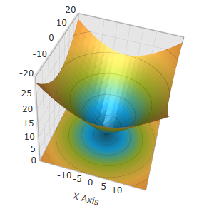

////

|metadata|
{
    "name": "surfacechart-configuring-axis-tick-marks-range",
    "controlName": ["{SurfaceChartName}"],
    "tags": [],
    "guid": "a484042c-90f0-4d98-aeba-1a9ef31e6ec7",  
    "buildFlags": ["wpf"],
    "createdOn": "2016-03-08T08:38:28.1480398Z"
}
|metadata|
////

= Configuring Axis Tick Marks Range

== Topic Overview

=== Purpose

This topic explains how to configure the axis tick marks range in the link:{SurfaceChartLink}.xamscattersurface3d_members.html[XamScatterSurface3D]™ control.

=== Required background

The following topics are prerequisites to understanding this topic:

[options="header", cols="a,a"]
|====
|Topic|Purpose

| link:surfacechart-getting-started-with-surfacechart.html[Adding xamScatterSurface3D To Your Page]
|This topic provides detailed instructions to help you get up and running as soon as possible with the _xamScatterSurface3D_™ control.

| link:surfacechart-features-overview.html[Features Overview]
|This topic explains the features supported by the control from developer perspective.

| link:surfacechart-visual-elements.html[Visual Elements]
|This topic provides an overview of the visual elements of the control.

|====

=== In this topic

This topic contains the following sections:

* <<_Ref445150233, Configuring Axis Tick Marks Range >>
* <<_Ref445150239, Related Content >>

** <<_Ref445150243,Topics>>
** <<_Ref445150247,Samples>>

[[_Ref445150233]]
== Configuring Axis Tick Marks Range

=== Overview

Use the link:{SurfaceChartLink}.linearaxis.html[LinearAxis] link:{SurfaceChartLink}.linearaxis~tickmarkminimumvalue.html[TickmarkMinimumValue] and link:{SurfaceChartLink}.linearaxis~tickmarkmaximumvalue.html[TickmarkMaximumValue] properties to set the axis tick marks range in the  _xamScatterSurface3D_   control.

=== Property settings

The following table maps the desired configuration to the property settings that manage it.

[options="header", cols="a,a,a"]
|====
|In order to:|Use this property:|And set it to:

|Configure the minimum tick mark value
| link:{SurfaceChartLink}.linearaxis~tickmarkminimumvalue.html[TickmarkMinimumValue]
|`double`

|Configure the maximum tick mark value
| link:{SurfaceChartLink}.linearaxis~tickmarkmaximumvalue.html[TickmarkMaximumValue]
|`double`

|====

=== Example

The screenshots and code snippets below demonstrates how the  _xamScatterSurface3D_   tick marks look by default and how they look as a result of the following settings:

[options="header", cols="a,a"]
|====
|Property|Value

| link:{SurfaceChartLink}.linearaxis~tickmarkminimumvalue.html[TickmarkMinimumValue]
| _-10_ 

| link:{SurfaceChartLink}.linearaxis~tickmarkmaximumvalue.html[TickmarkMaximumValue]
| _10_ 

|====

*In XAML:*

[source,xaml]
----
<ig:XamScatterSurface3D Name="SurfaceChart" 
 ItemsSource="{Binding Path=DataCollection}" 
 XMemberPath="X" YMemberPath="Y" ZMemberPath="Z">                 
 <ig:XamScatterSurface3D.XAxis>
        <ig:LinearAxis Title="X Axis" 
 TickmarkMinimumValue="-10" 
 TickmarkMaximumValue="10" />
 </ig:XamScatterSurface3D.XAxis>
</ig:XamScatterSurface3D>
----

*In C#:*

[source,csharp]
----
…
var linearAxis = new LinearAxis();
linearAxis.Title = "X Axis";
linearAxis.TickmarkMinimumValue = -10;
linearAxis.TickmarkMaximumValue = 10;
SurfaceChart.XAxis = linearAxis;
----

*In Visual Basic:*

[source,vb]
----
…
Dim linearAxis = New LinearAxis()
linearAxis.Title = "X Axis"
linearAxis.TickmarkMinimumValue = -10
linearAxis.TickmarkMaximumValue = 10
SurfaceChart.XAxis = linearAxis
----

[[_Ref445150239]]
== Related Content

[[_Ref445150243]]

=== Topics

The following topics provide additional information related to this topic.

[options="header", cols="a,a"]
|====
|Topic|Purpose

| link:surfacechart-grid-lines.html[Configuring Axis Grid Lines]
|This topic explains how to configure the brush and thickness of the grid lines in the _xamScatterSurface3D_ control.

| link:surfacechart-configuring-axis-interval.html[Configuring Axis Interval]
|This topic explains how to configure the axis interval in the _xamScatterSurface3D_ control.

| link:surfacechart-configuring-axis-label.html[Configuring Axis Label]
|The topics in this group explain how to configure different aspects of the visual representation of the axis label in the _xamScatterSurface3D_ control.

| link:surfacechart-configuring-axis-line.html[Configuring Axis Line]
|This topic explains how to configure the axes lines in the _xamScatterSurface3D_ control.

| link:surfacechart-configuring-axis-range.html[Configuring Axis Range]
|This topic explains how to configure the axis range by setting the MinimumValue and MaximumValue properties in the _xamScatterSurface3D_ control.

| link:surfacechart-configuring-axis-scales.html[Configuring Axis Types]
|This topic explains the axis types available in the _xamScatterSurface3D_ control.

| link:surfacechart-configuring-axis-title.html[Configuring Axis Title]
|The topics in this group explain how to configure different aspects of the visual representation of the axis title in the _xamScatterSurface3D_ control.

| link:surfacechart-inverting-axis.html[Inverting Axis]
|This topic explains how to invert an axis in the _xamScatterSurface3D_ control.

|====

[[_Ref445150247]]

=== Samples

The following sample provides additional information related to this topic.

[options="header", cols="a,a"]
|====
|Sample|Purpose

| link:{SamplesURL}/surface-chart/tickmarks-sample[Tick Marks]
|This sample demonstrates how to configure the tick marks minimum and maximum values in the _xamScatterSurface3D_ control.

|====