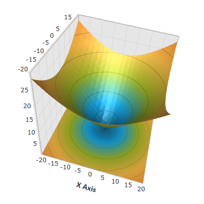

////

|metadata|
{
    "name": "surfacechart-configuring-axis-title-font-settings",
    "controlName": ["{SurfaceChartName}"],
    "tags": [],
    "guid": "89119c11-9836-4772-b00a-88181a40cd07",  
    "buildFlags": ["wpf"],
    "createdOn": "2016-03-01T19:58:03.233114Z"
}
|metadata|
////

= Configuring Axis Title Font Settings

== Topic Overview

=== Purpose

This topic explains how to configure the axis title font settings in the link:{SurfaceChartLink}.xamscattersurface3d_members.html[XamScatterSurface3D]™ control.

=== Required background

The following topics are prerequisites to understanding this topic:

[options="header", cols="a,a"]
|====
|Topic|Purpose

| link:surfacechart-getting-started-with-surfacechart.html[Adding xamScatterSurface3D To Your Page]
|This topic provides detailed instructions to help you get up and running as soon as possible with the _xamScatterSurface3D_™ control.

| link:surfacechart-features-overview.html[Features Overview]
|This topic explains the features supported by the control from developer perspective.

| link:surfacechart-visual-elements.html[Visual Elements]
|This topic provides an overview of the visual elements of the control.

|====

=== In this topic

This topic contains the following sections:

* <<_Ref443325755, Configuring Axis Title Font Settings >>
* <<_Ref443402331, Related Content >>

** <<_Ref443402335,Topics>>
** <<_Ref443402339,Samples>>

[[_Ref443325755]]
== Configuring Axis Title Font Settings

=== Overview

Use the link:{SurfaceChartLink}.surfacechartaxis.html[SurfaceChartAxis] link:{SurfaceChartLink}.surfacechartaxis~titlefontfamily.html[TitleFontFamily], link:{SurfaceChartLink}.surfacechartaxis~titlefontsize.html[TitleFontSize] and link:{SurfaceChartLink}.surfacechartaxis~titlefontweight.html[TitleFontWeight] properties to set font family, size and weight to the axis title text.

=== Property settings

The following table maps the desired configuration to the property settings that manage it.

[options="header", cols="a,a,a"]
|====
|In order to:|Use this property:|And set it to:

|Configure the axis title font family
| link:{SurfaceChartLink}.surfacechartaxis~titlefontfamily.html[TitleFontFamily]
|`FontFamily`

|Configure the axis title font size
| link:{SurfaceChartLink}.surfacechartaxis~titlefontsize.html[TitleFontSize]
|`double`

|Configure the axis title font weight
| link:{SurfaceChartLink}.surfacechartaxis~titlefontweight.html[TitleFontWeight]
|`FontWeight`

|====

=== Example

The screenshot below demonstrates how the axis title looks as a result of the following settings:

[options="header", cols="a,a"]
|====
|Property|Value

| link:{SurfaceChartLink}.surfacechartaxis~titlefontfamily.html[TitleFontFamily]
| _Calibri_ 

| link:{SurfaceChartLink}.surfacechartaxis~titlefontsize.html[TitleFontSize]
| _16_ 

| link:{SurfaceChartLink}.surfacechartaxis~titlefontweight.html[TitleFontWeight]
| _Bold_ 

|====

Following is the code that implements this example.

*In XAML:*

[source,xaml]
----
<ig:XamScatterSurface3D Name="SurfaceChart" 
 ItemsSource="{Binding Path=DataCollection}" 
 XMemberPath="X" YMemberPath="Y" ZMemberPath="Z" >
    <ig:XamScatterSurface3D.XAxis>
        <ig:LinearAxis 
 Title="X Axis" 
 TitleFontFamily="Calibri" 
 TitleFontSize="16" 
 TitleFontWeight="Bold" />
    </ig:XamScatterSurface3D.XAxis>
</ig:XamScatterSurface3D>
----

*In C#:*

[source,csharp]
----
var linearAxis = new LinearAxis();
linearAxis.Title = "X Axis";
linearAxis.TitleFontFamily = new FontFamily("Calibri");
linearAxis.TitleFontSize = 16;
linearAxis.TitleFontWeight = FontWeights.Bold;
SurfaceChart.XAxis = linearAxis;
----

*In Visual Basic:*

[source,vb]
----
Dim linearAxis = New LinearAxis()
linearAxis.Title = "X Axis"
linearAxis.TitleFontFamily = New FontFamily("Calibri")
linearAxis.TitleFontSize = 16
linearAxis.TitleFontWeight = FontWeights.Bold
SurfaceChart.XAxis = linearAxis
----

[[_Ref443402331]]
== Related Content

[[_Ref443402335]]

=== Topics

The following topics provide additional information related to this topic.

[options="header", cols="a,a"]
|====
|Topic|Purpose

| link:surfacechart-setting-axis-title.html[Setting Axis Title]
|This topic explains how to set axis title in the _xamScatterSurface3D_ control.

| link:surfacechart-configuring-axis-title-color-settings.html[Configuring Axis Title Color Settings]
|This topic explains how to configure the axis title background and foreground brush in the _xamScatterSurface3D_ control.

| link:surfacechart-configuring-axis-title-offset.html[Configuring Axis Title Offset]
|This topic explains how to configure the title offset from its axis in the _xamScatterSurface3D_ control.

| link:surfacechart-configuring-axis-title-visibility-settings.html[Configuring Axis Title Visibility Settings]
|This topic explains how to configure the axis title visibility and opacity in the _xamScatterSurface3D_ control.

| link:surfacechart-axis-title-templating.html[Axis Title Templating]
|This topic explains how to re-template the axis title in the _xamScatterSurface3D_ control.

|====

[[_Ref443402339]]

=== Samples

The following sample provides additional information related to this topic.

[options="header", cols="a,a"]
|====
|Sample|Purpose

| link:{SamplesURL}/surface-chart/axes-titles-sample[Axes Titles]
|This sample demonstrates how to customize the _xamScatterSurface3D_ control axes titles settings.

|====