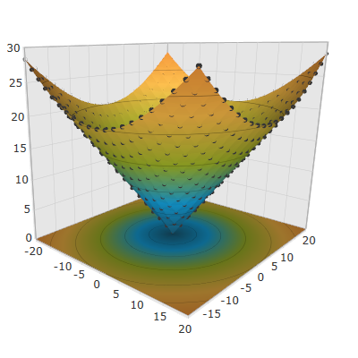
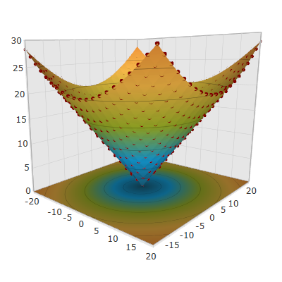

////

|metadata|
{
    "name": "surfacechart-configuring-data-point-markers",
    "controlName": ["{SurfaceChartName}"],
    "tags": [],
    "guid": "51157415-bc62-4e01-a9dd-9e0db881a017",  
    "buildFlags": ["wpf"],
    "createdOn": "2016-03-03T12:17:11.1190028Z"
}
|metadata|
////

= Configuring Data Point Markers

== Topic Overview

=== Purpose

This topic explains how to configure the data point markers in the link:{SurfaceChartLink}.xamscattersurface3d_members.html[XamScatterSurface3D]™ control.

=== Required background

The following topics are prerequisites to understanding this topic:

[options="header", cols="a,a"]
|====
|Topic|Purpose

| link:surfacechart-getting-started-with-surfacechart.html[Adding xamScatterSurface3D To Your Page]
|This topic provides detailed instructions to help you get up and running as soon as possible with the _xamScatterSurface3D_™ control.

| link:surfacechart-features-overview.html[Features Overview]
|This topic explains the features supported by the control from developer perspective.

| link:surfacechart-visual-elements.html[Visual Elements]
|This topic provides an overview of the visual elements of the control.

|====

The following table lists the external articles required as a prerequisite to understanding this topic.

==== Defining Material 

[options="header", cols="a,a"] 

|==== 

|Article|Purpose 

| link:https://msdn.microsoft.com/en-us/library/system.windows.media.media3d.material(v=vs.110).aspx[Material Class] 

|This articles describes how to use the abstract Material class in WPF. 

| link:https://msdn.microsoft.com/en-us/library/system.windows.media.media3d.diffusematerial(v=vs.110).aspx[DiffuseMaterial Class] 

|This articles describes how to define and use the DiffuseMaterial class in WPF. 

|==== 

==== Defining 3D Mesh Geometry 

[options="header", cols="a,a"] 

|==== 

|Article|Purpose 

| link:https://msdn.microsoft.com/en-us/library/system.windows.media.media3d.meshgeometry3d(v=vs.110).aspx[MeshGeometry3D Class] 

|This articles describes how to create a triangle primitive for building a 3-D shape. 

|====

=== In this topic

This topic contains the following sections:

* <<_Ref443939942, Showing Data Point Markers >>
* <<_Ref443939946, Configuring Data Point Marker Material >>
* <<_Ref443939952, Configuring Data Point Marker Mesh >>
* <<_Ref443939962, Configuring Data Point Marker Template >>
* <<_Ref443939966, Related Content >>

** <<_Ref443939986,Topics>>
** <<_Ref443939991,Samples>>

[[_Ref443939942]]
== Showing Data Point Markers

=== Overview

Use the link:{SurfaceChartLink}.xamscattersurface3d_members.html[XamScatterSurface3D] link:{SurfaceChartLink}.xamscattersurface3d~showpointmarkers.html[ShowPointMarkers] property to show/hide data point markers in the  _xamScatterSurface3D_   control.

By default, data point markers are not visible and this property value is `False`.

.Note
[NOTE]
====
Displaying the data point markers may influence the  _xamScatterSurface3D_   control performance.
====

=== Property settings

The following table maps the desired configuration to the property settings that manage it.

[options="header", cols="a,a,a"]
|====
|In order to:|Use this property:|And set it to:

|Show/hide data point markers
| link:{SurfaceChartLink}.xamscattersurface3d~showpointmarkers.html[ShowPointMarkers]
|`True/False`

|====

=== Example

The screenshot below demonstrates how the  _xamScatterSurface3D_   control looks as a result of the following settings:

[options="header", cols="a,a"]
|====
|Property|Value

| link:{SurfaceChartLink}.xamscattersurface3d~showpointmarkers.html[ShowPointMarkers]
|_True_

|====

Following is the code that implements this example.

*In XAML:*

[source,xaml]
----
<ig:XamScatterSurface3D Name="SurfaceChart" 
 ItemsSource="{Binding Path=DataCollection}" 
 XMemberPath="X" YMemberPath="Y" ZMemberPath="Z" 
 ShowPointMarkers="True"/>
----

*In C#:*

[source,csharp]
----
…
SurfaceChart.ShowPointMarkers = true;
----

*In Visual Basic:*

[source,vb]
----
…
SurfaceChart.ShowPointMarkers = True
----

[[_Ref443939946]]
== Configuring Data Point Marker Material

=== Overview

Use the link:{SurfaceChartLink}.xamscattersurface3d_members.html[XamScatterSurface3D] link:{SurfaceChartLink}.xamscattersurface3d~pointmarkermaterial.html[PointMarkerMaterial] property to configure the material of the  _xamScatterSurface3D_   control markers.

=== Property settings

The following table maps the desired configuration to the property settings that manage it.

[options="header", cols="a,a,a"]
|====
|In order to:|Use this property:|And set it to:

|Configure the marker material
| link:{SurfaceChartLink}.xamscattersurface3d~pointmarkermaterial.html[PointMarkerMaterial]
|`Material`

|====

=== Example

The screenshot below demonstrates how the markers looks as a result of the following settings:

[options="header", cols="a,a"]
|====
|Property|Value

| link:{SurfaceChartLink}.xamscattersurface3d~pointmarkermaterial.html[PointMarkerMaterial]
|_<DiffuseMaterial Brush="Red" />_

|====

Following is the code that implements this example.

*In XAML:*

[source,xaml]
----
<ig:XamScatterSurface3D Name="SurfaceChart" 
 ItemsSource="{Binding Path=DataCollection}" 
 XMemberPath="X" YMemberPath="Y" ZMemberPath="Z" 
 ShowPointMarkers="True">
    <ig:XamScatterSurface3D.PointMarkerMaterial>
        <DiffuseMaterial Brush="Red" />
    </ig:XamScatterSurface3D.PointMarkerMaterial>
</ig:XamScatterSurface3D>
----

*In C#:*

[source,csharp]
----
…
var diffuseMaterial = new DiffuseMaterial();
diffuseMaterial.Brush = new SolidColorBrush(Colors.Red);
SurfaceChart.ShowPointMarkers = true;
SurfaceChart.PointMarkerMaterial = diffuseMaterial;
----

*In Visual Basic:*

[source,vb]
----
…
Dim diffuseMaterial = New DiffuseMaterial()
diffuseMaterial.Brush = New SolidColorBrush(Colors.Red)
SurfaceChart.ShowPointMarkers = True
SurfaceChart.PointMarkerMaterial = diffuseMaterial
----

[[_Ref443939952]]
== Configuring Data Point Marker Mesh

=== Overview

Use the link:{SurfaceChartLink}.xamscattersurface3d_members.html[XamScatterSurface3D] link:{SurfaceChartLink}.xamscattersurface3d~pointmarkermesh.html[PointMarkerMesh] property to configure the 3D marker shape.

=== Property settings

The following table maps the desired configuration to the property settings that manage it.

[options="header", cols="a,a,a"]
|====
|In order to:|Use this property:|And set it to:

|Create a 3D marker mesh
| link:{SurfaceChartLink}.xamscattersurface3d~pointmarkermesh.html[PointMarkerMesh]
|`MeshGeometry3D`

|====

=== Example

The screenshot below demonstrates how the markers looks as a result of the following code:

Following is the code that implements this example.

*In XAML:*

[source,xaml]
----
<ig:XamScatterSurface3D Name="SurfaceChart" 
 ItemsSource="{Binding Path=DataCollection}" 
 XMemberPath="X" YMemberPath="Y" ZMemberPath="Z" 
 ShowPointMarkers="True">
    <ig:XamScatterSurface3D.PointMarkerMaterial>
        <DiffuseMaterial Brush="Red" />
    </ig:XamScatterSurface3D.PointMarkerMaterial>
    <ig:XamScatterSurface3D.PointMarkerMesh>
        <MeshGeometry3D Positions="-0.01 0.01 0.01, -0.01 -0.01 0.01, 
                                    0.01 0.01 0.01, 0.01 -0.01 0.01,
                                    0.01 0.01 -0.01, 0.01 -0.01 -0.01, 
                                   -0.01 0.01 -0.01, -0.01 -0.01 -0.01"
                        TextureCoordinates="0 0, 0 1, 1 0, 1 1,
                                            0 0, 0 1, 1 0, 1 1"
                        TriangleIndices="0  1  2,  1  3  2,
                                         6  7  0,  7  1  0,
                                         4  6  2,  6  0  2,
                                         2  3  4,  3  5  4,
                                         3  1  5,  1  7  5,
                                         4  5  6,  5  7  6" />
    </ig:XamScatterSurface3D.PointMarkerMesh>
</ig:XamScatterSurface3D>
----

[[_Ref443939962]]
== Configuring Data Point Marker Template

=== Overview

Use the link:{SurfaceChartLink}.xamscattersurface3d_members.html[XamScatterSurface3D] link:{SurfaceChartLink}.xamscattersurface3d~pointmarkertemplate.html[PointMarkerTemplate] property to use a DataTemplate for  _xamScatterSurface3D_   control markers.

.Note
[NOTE]
====
In order for the DataTemplate to be visible, the `PointMarkerMaterial` should have the `Viewport2DVisual3D.IsVisualHostMaterial` attached property set to `True`.
====

=== Property settings

The following table maps the desired configuration to the property settings that manage it.

[options="header", cols="a,a,a"]
|====
|In order to:|Use this property:|And set it to:

|Set a DataTemplate for each marker
| link:{SurfaceChartLink}.xamscattersurface3d~pointmarkertemplate.html[PointMarkerTemplate]
|`DataTemplate`

|====

=== Example

The screenshot below demonstrates how the  _xamScatterSurface3D_   control looks as a result of the following code:

Following is the code that implements this example.

*In XAML:*

[source,xaml]
----
<ig:XamScatterSurface3D Name="SurfaceChart" 
 ItemsSource="{Binding Path=DataCollection}" 
 XMemberPath="X" YMemberPath="Y" ZMemberPath="Z" 
 ShowPointMarkers="True">
    <ig:XamScatterSurface3D.PointMarkerMaterial>
        <DiffuseMaterial Viewport2DVisual3D.IsVisualHostMaterial="True" />
    </ig:XamScatterSurface3D.PointMarkerMaterial>
    <ig:XamScatterSurface3D.PointMarkerTemplate>
        <DataTemplate>
            <Rectangle Height="100" Width="100" Fill="Red" />
        </DataTemplate>
    </ig:XamScatterSurface3D.PointMarkerTemplate>
</ig:XamScatterSurface3D>
----

[[_Ref443939966]]
== Related Content

[[_Ref443939986]]

=== Topics

The following topic provides additional information related to this topic.

[options="header", cols="a,a"]
|====
|Topic|Purpose

| link:surfacechart-data-point-markers-mouse-events.html[Data Point Marker Mouse Events]
|This topic summarizes the data point marker mouse events in the _xamScatterSurface3D_ control.

|====

[[_Ref443939991]]

=== Samples

The following sample provides additional information related to this topic.

[options="header", cols="a,a"]
|====
|Sample|Purpose

| link:{SamplesURL}/surface-chart/markers-sample[Markers]
|This sample demonstrates how to display and customize the data point markers in the _xamScatterSurface3D_ control.

|====