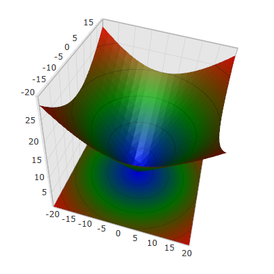
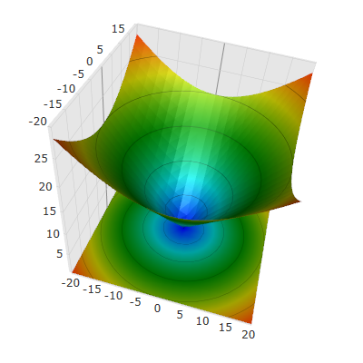

////

|metadata|
{
    "name": "surfacechart-configuring-series-colors",
    "controlName": ["{SurfaceChartName}"],
    "tags": [],
    "guid": "b0875dfc-aef8-4e19-9259-f7bd538626c7",  
    "buildFlags": ["wpf"],
    "createdOn": "2016-03-03T13:25:33.543091Z"
}
|metadata|
////

= Configuring Series Colors

== Topic Overview

=== Purpose

This topic explains how to apply a custom color palette to the link:{SurfaceChartLink}.xamscattersurface3d_members.html[XamScatterSurface3D]™ control series as well as how to configure the colors interpolation.

=== Required background

The following topics are prerequisites to understanding this topic:

[options="header", cols="a,a"]
|====
|Topic|Purpose

| link:surfacechart-getting-started-with-surfacechart.html[Adding xamScatterSurface3D To Your Page]
|This topic provides detailed instructions to help you get up and running as soon as possible with the _xamScatterSurface3D_™ control.

| link:surfacechart-features-overview.html[Features Overview]
|This topic explains the features supported by the control from developer perspective.

| link:surfacechart-visual-elements.html[Visual Elements]
|This topic provides an overview of the visual elements of the control.

|====

=== In this topic

This topic contains the following sections:

* <<_Ref443295926, Applying Custom Color Palette to Series >>
* <<_Ref443295932, Configuring Series Color Palette Interpolation >>
* <<_Ref443295939, Related Content >>

** <<_Ref443295943,Topics>>
** <<_Ref443295947,Samples>>

[[_Ref443295926]]
== Applying Custom Color Palette to Series

=== Overview

Use the link:{SurfaceChartLink}.xamscattersurface3d_members.html[XamScatterSurface3D] link:{SurfaceChartLink}.xamscattersurface3d~seriescolors.html[SeriesColors] property to apply a custom color palette to the  _xamScatterSurface3D_   control series.

.Note
[NOTE]
====
If the `XamScatterSurface3D` link:{SurfaceChartLink}.xamscattersurface3d~seriesmaterial.html[SeriesMaterial] is set, the `SeriesColors` property value is ignored.
====

=== Property settings

The following table maps the desired configuration to the property settings that manage it.

[options="header", cols="a,a,a"]
|====
|In order to:|Use this property:|And set it to:

|Apply a series color palette
| link:{SurfaceChartLink}.xamscattersurface3d~seriescolors.html[SeriesColors]
| link:{SurfaceChartLink}.colorcollection_members.html[ColorCollection]

|====

=== Example

The screenshot below demonstrates how the  _xamScatterSurface3D_   control series look as a result of the following settings:

[options="header", cols="a,a"]
|====
|Property|Value

| link:{SurfaceChartLink}.xamscattersurface3d~seriescolors.html[SeriesColors]
|_Blue Green Red_

|====

Following is the code that implements this example.

*In XAML:*

[source,xaml]
----
<ig:XamScatterSurface3D Name="SurfaceChart2" 
 ItemsSource="{Binding Path=DataCollection}" 
 XMemberPath="X" YMemberPath="Y" ZMemberPath="Z" 
 SeriesColors="Blue Green Red"/>
----

*In C#:*

[source,csharp]
----
var colorCollection = new ColorCollection();
colorCollection.Add(Colors.Blue);
colorCollection.Add(Colors.Green);
colorCollection.Add(Colors.Red);
SurfaceChart.SeriesColors = colorCollection;
----

*In Visual Basic:*

[source,vb]
----
Dim colorCollection = New ColorCollection()
colorCollection.Add(Colors.Blue)
colorCollection.Add(Colors.Green)
colorCollection.Add(Colors.Red)
SurfaceChart.SeriesColors = colorCollection
----

[[_Ref443295932]]
== Configuring Series Color Palette Interpolation

=== Overview

Use the link:{SurfaceChartLink}.xamscattersurface3d_members.html[XamScatterSurface3D] link:{SurfaceChartLink}.xamscattersurface3d~seriescolorinterpolation.html[SeriesColorInterpolation] property to specify the series colors interpolation in the  _xamScatterSurface3D_   control.

By default, the initial value of the `SeriesColorInterpolation` is `SeriesColorPaletteInterpolation.ARGB`.

There are three available options for series palette colors interpolation:

[cols="a,a,a"]
|====
|image::images/Series_Colors_2.png[]
|image::images/Series_Colors_3.png[]
|image::images/Series_Colors_4.png[]

|*AHSV*
|*ARGB*
|*None*

|====

=== Property settings

The following table maps the desired configuration to the property settings that manage it.

[options="header", cols="a,a,a"]
|====
|In order to:|Use this property:|And set it to:

|Specify the series colors interpolation
| link:{SurfaceChartLink}.xamscattersurface3d~seriescolorinterpolation.html[SeriesColorInterpolation]
| link:{SurfaceChartLink}.seriescolorpaletteinterpolation.html[SeriesColorPaletteInterpolation]

|====

=== Example

The screenshot below demonstrates how the  _xamScatterSurface3D_   control series colors looks as a result of the following settings:

[options="header", cols="a,a"]
|====
|Property|Value

| link:{SurfaceChartLink}.xamscattersurface3d~seriescolorinterpolation.html[SeriesColorInterpolation]
|_AHSV_

|====

Following is the code that implements this example.

*In XAML:*

[source,xaml]
----
<ig:XamScatterSurface3D Name="SurfaceChart" 
 ItemsSource="{Binding Path=DataCollection}" 
 XMemberPath="X" YMemberPath="Y" ZMemberPath="Z" 
 SeriesColorInterpolation="AHSV">
    <ig:XamScatterSurface3D.SeriesColors>
        <ig:ColorCollection>
            <Color>Blue</Color>
            <Color>Green</Color>
            <Color>Red</Color>
        </ig:ColorCollection>
    </ig:XamScatterSurface3D.SeriesColors>
</ig:XamScatterSurface3D>
----

*In C#:*

[source,csharp]
----
var colorCollection = new ColorCollection();
colorCollection.Add(Colors.Blue);
colorCollection.Add(Colors.Green);
colorCollection.Add(Colors.Red);
SurfaceChart.SeriesColors = colorCollection;
SurfaceChart.SeriesColorInterpolation = SeriesColorPaletteInterpolation.AHSV;
----

*In Visual Basic:*

[source,vb]
----
Dim colorCollection = New ColorCollection()
colorCollection.Add(Colors.Blue)
colorCollection.Add(Colors.Green)
colorCollection.Add(Colors.Red)
SurfaceChart.SeriesColors = colorCollection
SurfaceChart.SeriesColorInterpolation = SeriesColorPaletteInterpolation.AHSV
----

[[_Ref443295939]]
== Related Content

[[_Ref443295943]]

=== Topics

The following topics provide additional information related to this topic.

[options="header", cols="a,a"]
|====
|Topic|Purpose

| link:surfacechart-light-settings.html[Configuring Series Lighting]
|This topic explains how to configure the light settings in the _xamScatterSurface3D_ control.

| link:surfacechart-configuring-series-material.html[Configuring Series Material]
|This topic explains how to configure the material of the series of the _xamScatterSurface3D_ control.

| link:surfacechart-configuring-wireframe-material.html[Configuring Wireframe Material]
|This topic explains how to configure the material of the series wireframe of the _xamScatterSurface3D_ control.

| link:surfacechart-series-mouse-events.html[Series Mouse Events]
|This topic summarizes the series mouse events in the _xamScatterSurface3D_ control.

|====

[[_Ref443295947]]

=== Samples

The following sample provides additional information related to this topic.

[options="header", cols="a,a"]
|====
|Sample|Purpose

| link:{SamplesURL}/surface-chart/colors-palettes-sample[Series Colors]
|This sample demonstrates how different color palettes are applied to the _xamScatterSurface3D_ series as well as configuring the colors interpolation.

|====