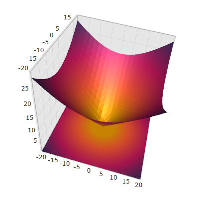

////

|metadata|
{
    "name": "surfacechart-configuring-series-material",
    "controlName": ["{SurfaceChartName}"],
    "tags": [],
    "guid": "d7a6d4d0-3e47-4f8e-bdc8-87bcba6b577d",  
    "buildFlags": ["wpf"],
    "createdOn": "2016-03-03T13:26:21.8964563Z"
}
|metadata|
////

= Configuring Series Material

== Topic Overview

=== Purpose

This topic explains how to configure the material of the series of the link:{SurfaceChartLink}.xamscattersurface3d_members.html[XamScatterSurface3D]™ control.

=== Required background

The following topics are prerequisites to understanding this topic:

[options="header", cols="a,a"]
|====
|Topic|Purpose

| link:surfacechart-getting-started-with-surfacechart.html[Adding xamScatterSurface3D To Your Page]
|This topic provides detailed instructions to help you get up and running as soon as possible with the _xamScatterSurface3D_™ control.

| link:surfacechart-features-overview.html[Features Overview]
|This topic explains the features supported by the control from developer perspective.

| link:surfacechart-visual-elements.html[Visual Elements]
|This topic provides an overview of the visual elements of the control.

|====

The following table lists the external articles required as a prerequisite to understanding this topic.

==== Defining Material 

[options="header", cols="a,a"] 

|==== 

|Article|Purpose 

| link:https://msdn.microsoft.com/en-us/library/system.windows.media.media3d.material(v=vs.110).aspx[Material Class] 

|This articles describes how to use the abstract Material class in WPF. 

| link:https://msdn.microsoft.com/en-us/library/system.windows.media.media3d.diffusematerial(v=vs.110).aspx[DiffuseMaterial Class] 

|This articles describes how to define and use the DiffuseMaterial class in WPF. 

|====

=== In this topic

This topic contains the following sections:

* <<_Ref443902682, Configuring Series Material >>
* <<_Ref443902685, Related Content >>

** <<_Ref443902691,Topics>>
** <<_Ref443902694,Samples>>

[[_Ref443902682]]
== Configuring Series Material

=== Overview

Use the link:{SurfaceChartLink}.xamscattersurface3d_members.html[XamScatterSurface3D] link:{SurfaceChartLink}.xamscattersurface3d~seriesmaterial.html[SeriesMaterial] property to configure the material of the  _xamScatterSurface3D_   control series.

=== Property settings

The following table maps the desired configuration to the property settings that manage it.

[options="header", cols="a,a,a"]
|====
|In order to:|Use this property:|And set it to:

|Configure the series material
| link:{SurfaceChartLink}.xamscattersurface3d~seriesmaterial.html[SeriesMaterial]
|`Material`

|====

=== Example

The screenshot below demonstrates how the  _xamScatterSurface3D_   control series looks as a result of the following settings:

[options="header", cols="a,a"]
|====
|Property|Value

| link:{SurfaceChartLink}.xamscattersurface3d~seriesmaterial.html[SeriesMaterial]
|

[source,xaml]
---- 
<DiffuseMaterial>  <DiffuseMaterial.Brush>  <LinearGradientBrush EndPoint="0.5,1" StartPoint="0.5,0">  <GradientStop Color="#FF372855" Offset="0"/>  <GradientStop Color="#FFC2185B" Offset="0.297"/>  <GradientStop Color="#FFF85931" Offset="0.587"/>  <GradientStop Color="#FFED9B03" Offset="0.82"/>  </LinearGradientBrush>  </DiffuseMaterial.Brush> </DiffuseMaterial> 
---- 

|====

Following is the code that implements this example.

*In XAML:*

[source,xaml]
----
<ig:XamScatterSurface3D Name="SurfaceChart" 
 ItemsSource="{Binding Path=DataCollection}" 
 XMemberPath="X" YMemberPath="Y" ZMemberPath="Z">
    <ig:XamScatterSurface3D.SeriesMaterial>
        <DiffuseMaterial>
            <DiffuseMaterial.Brush>
                <LinearGradientBrush EndPoint="0.5,1" StartPoint="0.5,0">
                    <GradientStop Color="#FF372855" Offset="0"/>
                    <GradientStop Color="#FFC2185B" Offset="0.297"/>
                    <GradientStop Color="#FFF85931" Offset="0.587"/>
                    <GradientStop Color="#FFED9B03" Offset="0.82"/>
                </LinearGradientBrush>
            </DiffuseMaterial.Brush>
        </DiffuseMaterial>
    </ig:XamScatterSurface3D.SeriesMaterial>
</ig:XamScatterSurface3D>
----

[[_Ref443902685]]
== Related Content

[[_Ref443902691]]

=== Topics

The following topics provide additional information related to this topic.

[options="header", cols="a,a"]
|====
|Topic|Purpose

| link:surfacechart-configuring-series-colors.html[Configuring Series Colors]
|This topic explains how to apply a custom color palette to the _xamScatterSurface3D_ control series as well as how to configure the colors interpolation.

| link:surfacechart-light-settings.html[Configuring Series Lighting]
|This topic explains how to configure the light settings in the _xamScatterSurface3D_ control.

| link:surfacechart-configuring-wireframe-material.html[Configuring Wireframe Material]
|This topic explains how to configure the material of the series wireframe of the _xamScatterSurface3D_ control.

| link:surfacechart-series-mouse-events.html[Series Mouse Events]
|This topic summarizes the series mouse events in the _xamScatterSurface3D_ control.

|====

[[_Ref443902694]]

=== Samples

The following sample provides additional information related to this topic.

[options="header", cols="a,a"]
|====
|Sample|Purpose

| link:{SamplesURL}/surface-chart/series-settings-sample[Series Settings]
|This sample demonstrates how to customize series and wireframe material in the _xamScatterSurface3D_ control.

|====