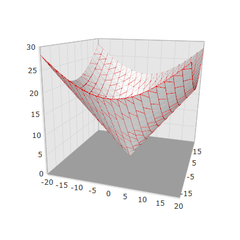
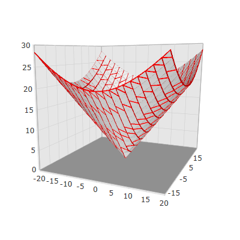

////

|metadata|
{
    "name": "surfacechart-configuring-wireframe-material",
    "controlName": ["{SurfaceChartName}"],
    "tags": [],
    "guid": "a0766524-eace-4575-a719-f16dce5bae91",  
    "buildFlags": ["wpf"],
    "createdOn": "2016-03-03T13:27:04.3169889Z"
}
|metadata|
////

= Configuring Wireframe Material

== Topic Overview

=== Purpose

This topic explains how to configure the material of the series wireframe of the link:{SurfaceChartLink}.xamscattersurface3d_members.html[XamScatterSurface3D]™ control.

=== Required background

The following topics are prerequisites to understanding this topic:

[options="header", cols="a,a"]
|====
|Topic|Purpose

| link:surfacechart-getting-started-with-surfacechart.html[Adding xamScatterSurface3D To Your Page]
|This topic provides detailed instructions to help you get up and running as soon as possible with the _xamScatterSurface3D_™ control.

| link:surfacechart-features-overview.html[Features Overview]
|This topic explains the features supported by the control from developer perspective.

| link:surfacechart-visual-elements.html[Visual Elements]
|This topic provides an overview of the visual elements of the control.

|====

The following table lists the external articles required as a prerequisite to understanding this topic.

==== Defining Material 

[options="header", cols="a,a"] 

|==== 

|Article|Purpose 

| link:https://msdn.microsoft.com/en-us/library/system.windows.media.media3d.material(v=vs.110).aspx[Material Class] 

|This articles describes how to use the abstract Material class in WPF. 

| link:https://msdn.microsoft.com/en-us/library/system.windows.media.media3d.diffusematerial(v=vs.110).aspx[DiffuseMaterial Class] 

|This articles describes how to define and use the DiffuseMaterial class in WPF. 

|====

=== In this topic

This topic contains the following sections:

* <<_Ref443904582, Configuring Wireframe Material >>
* <<_Ref443904586, Configuring Wireframe Thickness >>
* <<_Ref443904591, Related Content >>

** <<_Ref443904595,Topics>>
** <<_Ref443904599,Samples>>

[[_Ref443904582]]
== Configuring Wireframe Material

=== Overview

Use the link:{SurfaceChartLink}.xamscattersurface3d_members.html[XamScatterSurface3D] link:{SurfaceChartLink}.xamscattersurface3d~wireframematerial.html[WireframeMaterial] property to configure the material of the  _xamScatterSurface3D_   control series wireframe.

=== Property settings

The following table maps the desired configuration to the property settings that manage it.

[options="header", cols="a,a,a"]
|====
|In order to:|Use this property:|And set it to:

|Configure the series wireframe material
| link:{SurfaceChartLink}.xamscattersurface3d~wireframematerial.html[WireframeMaterial]
|`Material`

|====

=== Example

The screenshot below demonstrates how the  _xamScatterSurface3D_   control series wireframe looks as a result of the following settings:

[options="header", cols="a,a"]
|====
|Property|Value

| link:{SurfaceChartLink}.xamscattersurface3d~wireframematerial.html[WireframeMaterial]
| _<DiffuseMaterial Brush="Red"/>_ 

|====

Following is the code that implements this example.

*In XAML:*

[source,xaml]
----
<ig:XamScatterSurface3D Name="SurfaceChart" 
 ItemsSource="{Binding Path=DataCollection}" 
 XMemberPath="X" YMemberPath="Y" ZMemberPath="Z" 
 WireframeThickness="0.004">
    <ig:XamScatterSurface3D.SeriesMaterial>
        <DiffuseMaterial Brush="WhiteSmoke" />
    </ig:XamScatterSurface3D.SeriesMaterial>
    <ig:XamScatterSurface3D.WireframeMaterial>
        <DiffuseMaterial Brush="Red" />
    </ig:XamScatterSurface3D.WireframeMaterial>
</ig:XamScatterSurface3D>
----

*In C#:*

[source,csharp]
----
…
var diffuseMaterial = new DiffuseMaterial();
diffuseMaterial.Brush = new SolidColorBrush(Colors.Red);
SurfaceChart.WireframeThickness = 0.004;
SurfaceChart.WireframeMaterial = diffuseMaterial;
----

*In Visual Basic:*

[source,vb]
----
…
Dim diffuseMaterial = New DiffuseMaterial()
diffuseMaterial.Brush = New SolidColorBrush(Colors.Red)
SurfaceChart.WireframeThickness = 0.004
SurfaceChart.WireframeMaterial = diffuseMaterial
----

[[_Ref443904586]]
== Configuring Wireframe Thickness

=== Overview

Use the link:{SurfaceChartLink}.xamscattersurface3d_members.html[XamScatterSurface3D] link:{SurfaceChartLink}.xamscattersurface3d~wireframethickness.html[WireframeThickness] property to configure the thickness of the  _xamScatterSurface3D_   control series wireframe.

By default, the initial value of the `WireframeThickness` property is 0.002.

=== Property settings

The following table maps the desired configuration to the property settings that manage it.

[options="header", cols="a,a,a"]
|====
|In order to:|Use this property:|And set it to:

|Configure the series wireframe thickness
| link:{SurfaceChartLink}.xamscattersurface3d~wireframethickness.html[WireframeThickness]
|`double`

|====

=== Example

The screenshot below demonstrates how the  _xamScatterSurface3D_   control series wireframe looks as a result of the following settings:

[options="header", cols="a,a"]
|====
|Property|Value

| link:{SurfaceChartLink}.xamscattersurface3d~wireframethickness.html[WireframeThickness]
| _0.008_ 

|====

Following is the code that implements this example.

*In XAML:*

[source,xaml]
----
<ig:XamScatterSurface3D Name="SurfaceChart" 
 ItemsSource="{Binding Path=DataCollection}" 
 XMemberPath="X" YMemberPath="Y" ZMemberPath="Z" 
 WireframeThickness="0.008">
    <ig:XamScatterSurface3D.SeriesMaterial>
        <DiffuseMaterial Brush="WhiteSmoke" />
    </ig:XamScatterSurface3D.SeriesMaterial>
    <ig:XamScatterSurface3D.WireframeMaterial>
        <DiffuseMaterial Brush="Red" />
    </ig:XamScatterSurface3D.WireframeMaterial>
</ig:XamScatterSurface3D>
----

*In C#:*

[source,csharp]
----
…
var diffuseMaterial = new DiffuseMaterial();
diffuseMaterial.Brush = new SolidColorBrush(Colors.Red);
SurfaceChart.WireframeThickness = 0.008;
SurfaceChart.WireframeMaterial = diffuseMaterial;
----

*In Visual Basic:*

[source,vb]
----
…
Dim diffuseMaterial = New DiffuseMaterial()
diffuseMaterial.Brush = New SolidColorBrush(Colors.Red)
SurfaceChart.WireframeThickness = 0.008
SurfaceChart.WireframeMaterial = diffuseMaterial
----

[[_Ref443904591]]
== Related Content

[[_Ref443904595]]

=== Topics

The following topics provide additional information related to this topic.

[options="header", cols="a,a"]
|====
|Topic|Purpose

| link:surfacechart-configuring-series-colors.html[Configuring Series Colors]
|This topic explains how to apply a custom color palette to the _xamScatterSurface3D_ control series as well as how to configure the colors interpolation.

| link:surfacechart-light-settings.html[Configuring Series Lighting]
|This topic explains how to configure the light settings in the _xamScatterSurface3D_ control.

| link:surfacechart-configuring-series-material.html[Configuring Series Material]
|This topic explains how to configure the material of the series of the _xamScatterSurface3D_ control.

| link:surfacechart-series-mouse-events.html[Series Mouse Events]
|This topic summarizes the series mouse events in the _xamScatterSurface3D_ control.

|====

[[_Ref443904599]]

=== Samples

The following sample provides additional information related to this topic.

[options="header", cols="a,a"]
|====
|Sample|Purpose

| link:{SamplesURL}/surface-chart/series-settings-sample[Series Settings]
|This sample demonstrates how to customize series and wireframe material in the _xamScatterSurface3D_ control.

|====