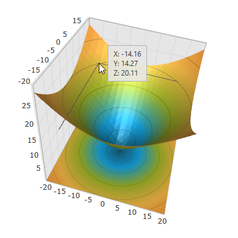
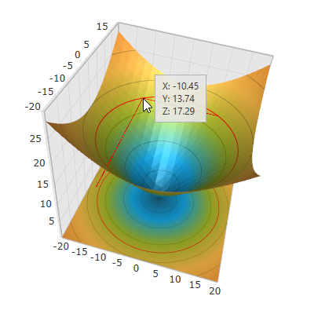
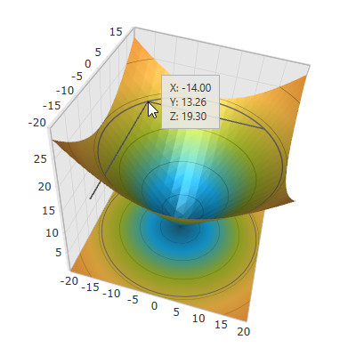

////

|metadata|
{
    "name": "surfacechart-crosshairs",
    "controlName": ["{SurfaceChartName}"],
    "tags": [],
    "guid": "a61a47db-f5b8-4b4a-8523-f5b2eef81e87",  
    "buildFlags": ["wpf"],
    "createdOn": "2016-02-29T13:49:52.4019827Z"
}
|metadata|
////

= Crosshairs Settings

== Topic Overview

=== Purpose

This topic explains how to configure to the crosshairs in the link:{SurfaceChartLink}.xamscattersurface3d_members.html[XamScatterSurface3D]™ control.

=== Required background

The following topics are prerequisites to understanding this topic:

[options="header", cols="a,a"]
|====
|Topic|Purpose

| link:surfacechart-getting-started-with-surfacechart.html[Adding xamScatterSurface3D To Your Page]
|This topic provides detailed instructions to help you get up and running as soon as possible with the _xamScatterSurface3D_™ control.

| link:surfacechart-features-overview.html[Features Overview]
|This topic explains the features supported by the control from developer perspective.

| link:surfacechart-visual-elements.html[Visual Elements]
|This topic provides an overview of the visual elements of the control.

|====

=== In this topic

This topic contains the following sections:

* <<_Ref443128949, Configuring Crosshairs Visibility >>
* <<_Ref443128954, Configuring Crosshair Brush >>
* <<_Ref443128959, Configuring Crosshair Thickness >>
* <<_Ref443128963, Related Content >>

** <<_Ref443128967,Topics>>
** <<_Ref443128971,Samples>>

[[_Ref443128949]]
== Configuring Crosshairs Visibility

=== Overview

Crosshairs appears as a set of thin lines on mouse hover over the  _xamScatterSurface3D_   series surface. They intersect at the mouse pointer and help the user to locate precisely a data point of interest.

Use the link:{SurfaceChartLink}.xamscattersurface3d_members.html[XamScatterSurface3D] link:{SurfaceChartLink}.xamchart3d~crosshairaxes.html[CrosshairAxes] property to configure for which axes the crosshairs are visible.

By default, the crosshairs are enabled for all axes and the initial value of the `CrosshairAxes` is `AxisFlags3D.XYZ`.

=== Property settings

The following table maps the desired configuration to the property settings that manage it.

[options="header", cols="a,a,a"]
|====
|In order to:|Use this property:|And set it to:

|Configure the crosshairs visibility for specific axes
| link:{SurfaceChartLink}.xamchart3d~crosshairaxes.html[CrosshairAxes]
| link:{SurfaceChartLink}.axisflags3d.html[AxisFlags3D]

|====

=== Example

The screenshot below demonstrates how the  _xamScatterSurface3D_   control crosshairs behave as a result of the following settings:

[options="header", cols="a,a"]
|====
|Property|Value

| link:{SurfaceChartLink}.xamchart3d~crosshairaxes.html[CrosshairAxes]
| _XY_ 

|====

Following is the code that implements this example.

*In XAML:*

[source,xaml]
----
<ig:XamScatterSurface3D Name="SurfaceChart" 
 ItemsSource="{Binding Path=DataCollection}" 
 XMemberPath="X" YMemberPath="Y" ZMemberPath="Z" 
 CrosshairAxes="XY" />
----

*In C#:*

[source,csharp]
----
…
SurfaceChart.CrosshairAxes = AxisFlags3D.XY;
----

*In Visual Basic:*

[source,vb]
----
…
SurfaceChart.CrosshairAxes = AxisFlags3D.XY
----

[[_Ref443128954]]
== Configuring Crosshair Brush

=== Overview

Use the link:{SurfaceChartLink}.xamscattersurface3d_members.html[XamScatterSurface3D] link:{SurfaceChartLink}.xamchart3d~crosshairbrush.html[CrosshairBrush] property to configure the crosshair brush.

=== Property settings

The following table maps the desired configuration to the property settings that manage it.

[options="header", cols="a,a,a"]
|====
|In order to:|Use this property:|And set it to:

|Modify the crosshair brush
| link:{SurfaceChartLink}.xamchart3d~crosshairbrush.html[CrosshairBrush]
|`Brush`

|====

=== Example

The screenshot below demonstrates how the x _amScatterSurface3D_   crosshairs looks as a result of the following settings:

[options="header", cols="a,a"]
|====
|Property|Value

| link:{SurfaceChartLink}.xamchart3d~crosshairbrush.html[CrosshairBrush]
| _Red_ 

|====

Following is the code that implements this example.

*In XAML:*

[source,xaml]
----
<ig:XamScatterSurface3D Name="SurfaceChart" 
 ItemsSource="{Binding Path=DataCollection}" 
 XMemberPath="X" YMemberPath="Y" ZMemberPath="Z" 
 CrosshairBrush="Red"/>
----

*In C#:*

[source,csharp]
----
…
SurfaceChart.CrosshairBrush = new SolidColorBrush(Colors.Red);
----

*In Visual Basic:*

[source,vb]
----
…
SurfaceChart.CrosshairBrush = New SolidColorBrush(Colors.Red)
----

[[_Ref443128959]]
== Configuring Crosshair Thickness

=== Overview

Use the link:{SurfaceChartLink}.xamscattersurface3d_members.html[XamScatterSurface3D] link:{SurfaceChartLink}.xamchart3d~crosshairthickness.html[CrosshairThickness] property to configure the crosshair thickness.

=== Property settings

The following table maps the desired configuration to the property settings that manage it.

[options="header", cols="a,a,a"]
|====
|In order to:|Use this property:|And set it to:

|Modify the crosshair thickness
| link:{SurfaceChartLink}.xamchart3d~crosshairthickness.html[CrosshairThickness]
|`double`

|====

=== Example

The screenshot below demonstrates how the x _amScatterSurface3D_   crosshairs looks as a result of the following settings:

[options="header", cols="a,a"]
|====
|Property|Value

| link:{SurfaceChartLink}.xamchart3d~crosshairthickness.html[CrosshairThickness]
| _3_ 

|====

Following is the code that implements this example.

*In XAML:*

[source,xaml]
----
<ig:XamScatterSurface3D Name="SurfaceChart" 
 ItemsSource="{Binding Path=DataCollection}" 
 XMemberPath="X" YMemberPath="Y" ZMemberPath="Z" 
 CrosshairThickness="3"/>
----

*In C#:*

[source,csharp]
----
…
SurfaceChart.CrosshairThickness = 3;
----

*In Visual Basic:*

[source,vb]
----
…
SurfaceChart.CrosshairThickness = 3
----

[[_Ref443128963]]
== Related Content

[[_Ref443128967]]

=== Topics

The following topics provide additional information related to this topic.

[options="header", cols="a,a"]
|====
|Topic|Purpose

| link:surfacechart-aspect-perspective.html[Aspect and Perspective]
|This topic explains how to configure the aspect and perspective of the _xamScatterSurface3D_ control.

| link:surfacechart-axis.html[Axis Settings]
|The topics in this group explain how to configure different axis settings in the _xamScatterSurface3D_ control.

| link:surfacechart-cube.html[Cube Settings]
|This topic explains how to configure the rim thickness and the material of the cube of the _xamScatterSurface3D_ control.

| link:surfacechart-data-point-marker.html[Data Point Markers]
|The topics in this group explain how to configure the data point markers in the _xamScatterSurface3D_ control.

| link:surfacechart-floor.html[Floor Settings]
|This topic explains how to configure the floor settings of the _xamScatterSurface3D_ control.

| link:surfacechart-performance.html[Performance]
|This topic explains how the _xamScatterSurface3D_ control performance can be optimized when rendering a large set of data points.

| link:surfacechart-rotation.html[Rotation]
|This topic explains how to configure the _xamScatterSurface3D_ control rotation using code.

| link:surfacechart-series.html[Series Settings]
|The topics in this group explain how to configure different series settings in the _xamScatterSurface3D_ control.

| link:surfacechart-tooltip.html[Tooltip]
|This topic explains how to show/hide the default tooltip and how apply a custom tooltip using DataTemplate in the _xamScatterSurface3D_ control.

| link:surfacechart-zooming.html[Zooming]
|This topic explains how to perform the scaling of the _xamScatterSurface3D_ control.

|====

[[_Ref443128971]]

=== Samples

The following sample provides additional information related to this topic.

[options="header", cols="a,a"]
|====
|Sample|Purpose

| link:{SamplesURL}/surface-chart/crosshair-sample[Crosshair Settings]
|This sample demonstrates how to display _xamScatterSurface3D_ crosshairs on mouse hover and configure their thickness and color.

|====