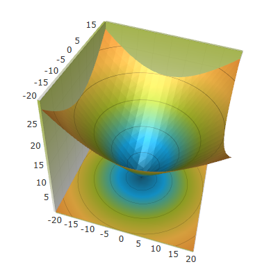
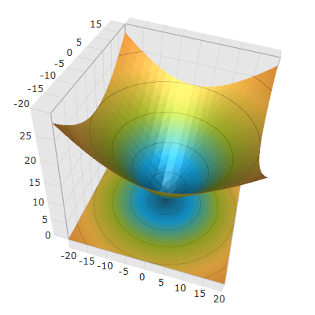

////

|metadata|
{
    "name": "surfacechart-cube",
    "controlName": ["{SurfaceChartName}"],
    "tags": [],
    "guid": "c7e8ca38-bdae-47b5-9c99-429edc28a89e",  
    "buildFlags": ["wpf"],
    "createdOn": "2016-02-29T13:51:46.8150285Z"
}
|metadata|
////

= Cube Settings

== Topic Overview

=== Purpose

This topic explains how to configure the rim thickness and the material of the cube of the link:{SurfaceChartLink}.xamscattersurface3d_members.html[XamScatterSurface3D]™ control.

=== Required background

The following topics are prerequisites to understanding this topic:

[options="header", cols="a,a"]
|====
|Topic|Purpose

| link:surfacechart-getting-started-with-surfacechart.html[Adding xamScatterSurface3D To Your Page]
|This topic provides detailed instructions to help you get up and running as soon as possible with the _xamScatterSurface3D_™ control.

| link:surfacechart-features-overview.html[Features Overview]
|This topic explains the features supported by the control from developer perspective.

| link:surfacechart-visual-elements.html[Visual Elements]
|This topic provides an overview of the visual elements of the control.

|====

The following table lists the external articles required as a prerequisite to understanding this topic.

==== Defining Material 

[options="header", cols="a,a"] 

|==== 

|Article|Purpose 

| link:https://msdn.microsoft.com/en-us/library/system.windows.media.media3d.material(v=vs.110).aspx[Material Class] 

|This articles describes how to use the abstract Material class in WPF. 

| link:https://msdn.microsoft.com/en-us/library/system.windows.media.media3d.diffusematerial(v=vs.110).aspx[DiffuseMaterial Class] 

|This articles describes how to define and use the DiffuseMaterial class in WPF. 

|====

=== In this topic

This topic contains the following sections:

* <<_Ref443682190, Configuring Cube Material >>
* <<_Ref443682183, Configuring Cube Rim Thickness >>
* <<_Ref443682201, Related Content >>

** <<_Ref443682205,Topics>>
** <<_Ref443682209,Samples>>

[[_Ref443682190]]
[[_Ref443682183]]
== Configuring Cube Material

=== Overview

Use the link:{SurfaceChartLink}.xamscattersurface3d_members.html[XamScatterSurface3D] link:{SurfaceChartLink}.xamchart3d~cubematerial.html[CubeMaterial] property to configure the material of the  _xamScatterSurface3D_   control background cube.

=== Property settings

The following table maps the desired configuration to the property settings that manage it.

[options="header", cols="a,a,a"]
|====
|In order to:|Use this property:|And set it to:

|Configure the background cube material
| link:{SurfaceChartLink}.xamchart3d~cubematerial.html[CubeMaterial]
|`Material`

|====

=== Example

The screenshot below demonstrates how the  _xamScatterSurface3D_   control cube looks as a result of the following settings:

[options="header", cols="a,a"]
|====
|Property|Value

| link:{SurfaceChartLink}.xamchart3d~cubematerial.html[CubeMaterial]
|

[source,xaml]
---- 
<DiffuseMaterial>  <DiffuseMaterial.Brush>  <LinearGradientBrush StartPoint="0.5,0" EndPoint="0.5,1" Opacity="0.8">  <GradientStop Color="#FFF2F2F2" Offset="1"/>  <GradientStop Color="#FFA4BA29" Offset="0"/>  </LinearGradientBrush>  </DiffuseMaterial.Brush> </DiffuseMaterial> 
---- 

|====

Following is the code that implements this example.

*In XAML:*

[source,xaml]
----
<ig:XamScatterSurface3D Name="SurfaceChart" 
 ItemsSource="{Binding Path=DataCollection}" 
 XMemberPath="X" YMemberPath="Y" ZMemberPath="Z">
    <ig:XamScatterSurface3D.CubeMaterial>
        <DiffuseMaterial>
            <DiffuseMaterial.Brush>
                <LinearGradientBrush StartPoint="0.5,0" EndPoint="0.5,1" Opacity="0.8">
                    <GradientStop Color="#FFF2F2F2" Offset="1"/>
                    <GradientStop Color="#FFA4BA29" Offset="0"/>
                </LinearGradientBrush>
            </DiffuseMaterial.Brush>
        </DiffuseMaterial>
    </ig:XamScatterSurface3D.CubeMaterial>
</ig:XamScatterSurface3D>
----

== Configuring Cube Rim Thickness

=== Overview

Use the link:{SurfaceChartLink}.xamscattersurface3d_members.html[XamScatterSurface3D] link:{SurfaceChartLink}.xamchart3d~rimthickness.html[RimThickness] property to configure the thickness of the cube rim of the  _xamScatterSurface3D_   control.

This property value is a value between 0 and 1, relative to the size of the entire cube.

=== Property settings

The following table maps the desired configuration to the property settings that manage it.

[options="header", cols="a,a,a"]
|====
|In order to:|Use this property:|And set it to:

|Configure the cube rim thickness
| link:{SurfaceChartLink}.xamchart3d~rimthickness.html[RimThickness]
|`double`

|====

=== Example

The screenshot below demonstrates how the  _xamScatterSurface3D_   control cube looks as a result of the following settings:

[options="header", cols="a,a"]
|====
|Property|Value

| link:{SurfaceChartLink}.xamchart3d~rimthickness.html[RimThickness]
| _0.1_ 

|====

Following is the code that implements this example.

*In XAML:*

[source,xaml]
----
<ig:XamScatterSurface3D Name="SurfaceChart" 
 ItemsSource="{Binding Path=DataCollection}" 
 XMemberPath="X" YMemberPath="Y" ZMemberPath="Z" 
 RimThickness="0.1"/>
----

*In C#:*

[source,csharp]
----
…
SurfaceChart.RimThickness = 0.1;
----

*In Visual Basic:*

[source,vb]
----
…
SurfaceChart.RimThickness = 0.1
----

[[_Ref443682201]]
== Related Content

[[_Ref443682205]]

=== Topics

The following topics provide additional information related to this topic.

[options="header", cols="a,a"]
|====
|Topic|Purpose

| link:surfacechart-aspect-perspective.html[Aspect and Perspective]
|This topic explains how to configure the aspect and perspective of the _xamScatterSurface3D_ control.

| link:surfacechart-axis.html[Axis Settings]
|The topics in this group explain how to configure different axis settings in the _xamScatterSurface3D_ control.

| link:surfacechart-crosshairs.html[Crosshairs Settings]
|This topic explains how to configure to the crosshairs in the _xamScatterSurface3D_ control.

| link:surfacechart-data-point-marker.html[Data Point Markers]
|The topics in this group explain how to configure the data point markers in the _xamScatterSurface3D_ control.

| link:surfacechart-floor.html[Floor Settings]
|This topic explains how to configure the floor settings of the _xamScatterSurface3D_ control.

| link:surfacechart-performance.html[Performance]
|This topic explains how the _xamScatterSurface3D_ control performance can be optimized when rendering a large set of data points.

| link:surfacechart-rotation.html[Rotation]
|This topic explains how to configure the _xamScatterSurface3D_ control rotation using code.

| link:surfacechart-series.html[Series Settings]
|The topics in this group explain how to configure different series settings in the _xamScatterSurface3D_ control.

| link:surfacechart-tooltip.html[Tooltip]
|This topic explains how to show/hide the default tooltip and how apply a custom tooltip using DataTemplate in the _xamScatterSurface3D_ control.

| link:surfacechart-zooming.html[Zooming]
|This topic explains how to perform the scaling of the _xamScatterSurface3D_ control.

|====

[[_Ref443682209]]

=== Samples

The following sample provides additional information related to this topic.

[options="header", cols="a,a"]
|====
|Sample|Purpose

| link:{SamplesURL}/surface-chart/cube-settings-sample[Cube Settings]
|This sample demonstrates how to configure _xamScatterSurface3D_ cube material as well as the rim thickness.

|====