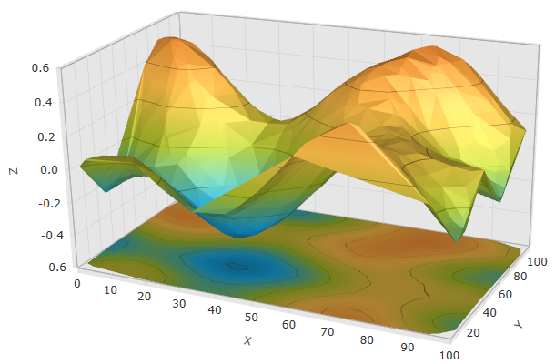
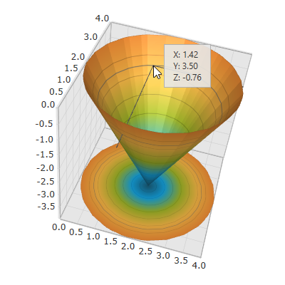
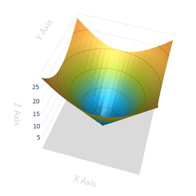
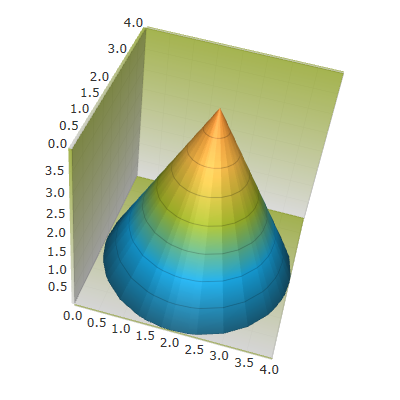
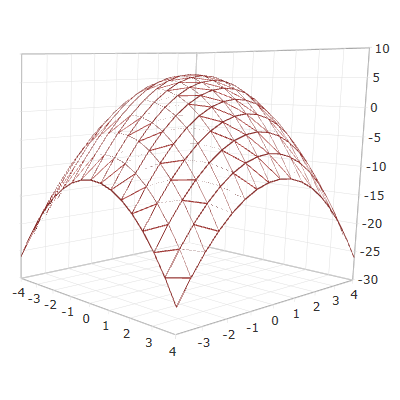
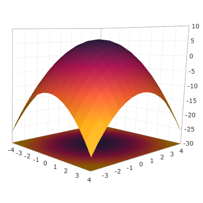
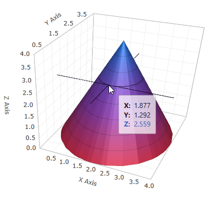

////
|metadata|
{
    "name": "surfacechart-features-overview",
    "controlName": ["{SurfaceChartName}"],
    "tags": [],
    "guid": "3f543a22-5762-447e-b06f-937629891ffe",
    "buildFlags": ["wpf"],
    "createdOn": "2016-02-29T13:36:50.2239621Z"
}
|metadata|
////

= Features Overview

== Topic Overview

=== Purpose

This topic explains the features supported by the control from a developer's perspective.

=== In this topic

This topic contains the following sections:

* <<_Ref445151869, Introduction >>
* <<_Ref445151873, Main Features >>
* <<_Ref445151878, Related Content >>

** <<_Ref445151883,Topics>>
** <<_Ref445151887,Samples>>

[[_Ref445151869]]
== Introduction

=== xamScatterSurface3D summary

The link:{SurfaceChartLink}.xamscattersurface3d_members.html[XamScatterSurface3D]™ control allows fast, visually appealing and customizable 3D surface visualization of scatter data.

The control offers a full set of API options to achieve any 3D surface plotting requirement and very intuitive defaults to minimize the coding required.

The  _xamScatterSurface3D_   control offers full customization options for many of its key elements, such as series, plotlines, axes and markers.

Additionally, the  _xamScatterSurface3D_   control comes with a rich set of themes.

[[_Ref445151873]]
== Main Features

=== Crosshairs

Crosshairs are displayed by default in the  _xamScatterSurface3D_   control and appear on mouse hover over the surface.

==== Related Topics:

* link:surfacechart-crosshairs.html[Crosshairs Settings]

=== Customizable Axis Settings

The  _xamScatterSurface3D_   control offers full customization of the axes settings, axis inversion, linear and logarithmic axis.

The control also provides the functionality for displaying and further customizing its labels and titles.

==== Related Topics:

* link:surfacechart-axis.html[Axis Settings]

=== Customizable Cube Settings

The  _xamScatterSurface3D_   control offers full customization of the surface cube texture and other cube properties – as grid lines, series projection on the floor and rim thickness.

==== Related Topics:

* link:surfacechart-cube.html[Cube Settings]
* link:surfacechart-floor.html[Floor Settings]
* link:surfacechart-grid-lines.html[Grid Lines Settings]

=== Customizable Series Settings

The  _xamScatterSurface3D_   control offers full customization of the series settings - series colors and texture.

For faster plotting of large data sets, series may be displayed as a wireframe surface with configurable texture and thickness.

==== Related Topics:

* link:surfacechart-series.html[Series Settings]

=== Rotation

The  _xamScatterSurface3D_   control is easily rotated either by mouse, keyboard arrows keys or by touch gesture.

==== Related Topics:

* link:surfacechart-rotation.html[Rotation]

=== Tooltip

Tooltip appears on mouse hover in the  _xamScatterSurface3D_   control and gives precise information about the selected data point. The tooltip can be re-templated.

==== Related Topics:

* link:surfacechart-tooltip.html[Tooltip]

[[_Ref445151878]]

=== Touch Support

The  _xamScatterSurface3D_   control uses standard touch gestures to initiate operations such as rotation and zooming.

==== Related Topics:

* link:surfacechart-interacting-with-touch-gestures.html[Interacting with Touch Gestures]

=== Zooming

Zooming in/out can be achieved either programmatically or by using the mouse wheel.

==== Related Topics:

* link:surfacechart-zooming.html[Zooming]

== Related Content

[[_Ref445151883]]

=== Topics

The following topics provide additional information related to this topic.

[options="header", cols="a,a"]
|====
|Topic|Purpose

| link:surfacechart-visual-elements.html[Visual Elements]
|This topic provides an overview of the visual elements of the control.

| link:surfacechart-user-interactions.html[User Interactions]
|The topics in this group summarize the user interactions available in the _xamScatterSurface3D_ control.

|====

[[_Ref445151887]]

=== Samples

The following sample provides additional information related to this topic.

[options="header", cols="a,a"]
|====
|Sample|Purpose

| link:{SamplesURL}/surface-chart/basic-sample[First Look]
|This sample demonstrates some of the _xamScatterSurface3D_ key features as zooming, tooltip and crosshairs as well as surface colors configuration.

| link:{SamplesURL}/surface-chart/binding-live-data-sample[Binding Live Data]
|This sample demonstrates how the _xamScatterSurface3D_ control displays changing data collection.

| link:{SamplesURL}/surface-chart/binding-shapefiles-sample[Binding Shapefiles]
|This sample demonstrates how to bind the _xamScatterSurface3D_ control to shapefiles data.

|====