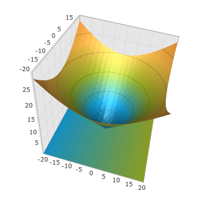
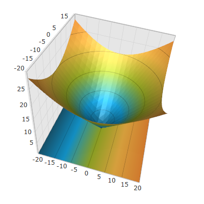

////

|metadata|
{
    "name": "surfacechart-floor",
    "controlName": ["{SurfaceChartName}"],
    "tags": [],
    "guid": "546860be-19bd-4cf8-a9c9-cc55f2eeadc0",  
    "buildFlags": ["wpf"],
    "createdOn": "2016-02-29T13:55:07.229296Z"
}
|metadata|
////

= Floor Settings

== Topic Overview

=== Purpose

This topic explains how to configure the floor settings of the link:{SurfaceChartLink}.xamscattersurface3d_members.html[XamScatterSurface3D]™ control.

=== Required background

The following topics are prerequisites to understanding this topic:

[options="header", cols="a,a"]
|====
|Topic|Purpose

| link:surfacechart-getting-started-with-surfacechart.html[Adding xamScatterSurface3D To Your Page]
|This topic provides detailed instructions to help you get up and running as soon as possible with the _xamScatterSurface3D_™ control.

| link:surfacechart-features-overview.html[Features Overview]
|This topic explains the features supported by the control from developer perspective.

| link:surfacechart-visual-elements.html[Visual Elements]
|This topic provides an overview of the visual elements of the control.

|====

The following table lists the external articles required as a prerequisite to understanding this topic.

==== Defining Material 

[options="header", cols="a,a"] 

|==== 

|Article|Purpose 

| link:https://msdn.microsoft.com/en-us/library/system.windows.media.media3d.material(v=vs.110).aspx[Material Class] 

|This articles describes how to use the abstract Material class in WPF. 

| link:https://msdn.microsoft.com/en-us/library/system.windows.media.media3d.diffusematerial(v=vs.110).aspx[DiffuseMaterial Class] 

|This articles describes how to define and use the DiffuseMaterial class in WPF. 

|==== 

==== Defining 3D Mesh Geometry 

[options="header", cols="a,a"] 

|==== 

|Article|Purpose 

| link:https://msdn.microsoft.com/en-us/library/system.windows.media.media3d.meshgeometry3d(v=vs.110).aspx[MeshGeometry3D Class] 

|This articles describes how to create a triangle primitive for building a 3-D shape. 

|====

=== In this topic

This topic contains the following sections:

* <<_Ref443724535, Configuring Floor Material >>
* <<_Ref443724539, Configuring Floor Projection >>
* <<_Ref443724546, Related Content >>

** <<_Ref443724551,Topics>>
** <<_Ref443724556,Samples>>

[[_Ref443724535]]
== Configuring Floor Material

=== Overview

Use the link:{SurfaceChartLink}.xamscattersurface3d_members.html[XamScatterSurface3D] link:{SurfaceChartLink}.xamscattersurface3d~floormaterial.html[FloorMaterial] property to configure the material of the floor.

By default, the `FloorMaterial` is bound to the link:{SurfaceChartLink}.xamscattersurface3d~actualseriesmaterial.html[ActualSeriesMaterial] property which is a composite of the link:{SurfaceChartLink}.xamscattersurface3d~seriesmaterial.html[SeriesMaterial] (or link:{SurfaceChartLink}.xamscattersurface3d~seriescolors.html[SeriesColors] when the `SeriesMaterial` is null), along with some default materials applied by the  _xamScatterSurface3D_   control.

=== Property settings

The following table maps the desired configuration to the property settings that manage it.

[options="header", cols="a,a,a"]
|====
|In order to:|Use this property:|And set it to:

|Configure the floor material
| link:{SurfaceChartLink}.xamscattersurface3d~floormaterial.html[FloorMaterial]
|`Material`

|====

=== Example

The screenshot below demonstrates how the  _xamScatterSurface3D_   control floor looks as a result of the following settings:

[options="header", cols="a,a"]
|====
|Property|Value

| link:{SurfaceChartLink}.xamscattersurface3d~floormaterial.html[FloorMaterial]
|

[source,xaml]
---- 
<DiffuseMaterial>  <DiffuseMaterial.Brush>  <LinearGradientBrush StartPoint="0,0.5" EndPoint="1.0,0.5">  <GradientStop Offset="0.0" Color="#FF16A9E7" />  <GradientStop Offset="1.0" Color="#FFA4BA29" />  </LinearGradientBrush>  </DiffuseMaterial.Brush> </DiffuseMaterial> 
---- 

|====

Following is the code that implements this example.

*In XAML:*

[source,xaml]
----
<ig:XamScatterSurface3D Name="SurfaceChart" 
 ItemsSource="{Binding Path=DataCollection}" 
 XMemberPath="X" YMemberPath="Y" ZMemberPath="Z"                                         
 ShowFloorProjection=">
    <ig:XamScatterSurface3D.FloorMaterial>
        <DiffuseMaterial>
            <DiffuseMaterial.Brush>
                <LinearGradientBrush StartPoint="0,0.5" EndPoint="1.0,0.5">
                    <GradientStop Offset="0.0" Color="#FF16A9E7" />
                    <GradientStop Offset="1.0" Color="#FFA4BA29" />
                </LinearGradientBrush>
            </DiffuseMaterial.Brush>
        </DiffuseMaterial>
    </ig:XamScatterSurface3D.FloorMaterial>
</ig:XamScatterSurface3D>
----

[[_Ref443724539]]
== Configuring Floor Projection

=== Overview

Use the link:{SurfaceChartLink}.xamscattersurface3d_members.html[XamScatterSurface3D] link:{SurfaceChartLink}.xamscattersurface3d~showfloorprojection.html[ShowFloorProjection] property to enable/disable the projection of the series on the floor of the  _xamScatterSurface3D_   control.

By default, the projection is enabled and the value of this property is `True`.

=== Property settings

The following table maps the desired configuration to the property settings that manage it.

[options="header", cols="a,a,a"]
|====
|In order to:|Use this property:|And set it to:

|Enable/disable the series projection on the floor
| link:{SurfaceChartLink}.xamscattersurface3d~showfloorprojection.html[ShowFloorProjection]
|`True/False`

|====

=== Example

The screenshots below demonstrate how the  _xamScatterSurface3D_   control floor looks with enabled and disabled projection:

*In XAML:*

[source,xaml]
----
<ig:XamScatterSurface3D Name="SurfaceChart" 
 ItemsSource="{Binding Path=DataCollection}" 
 XMemberPath="X" YMemberPath="Y" ZMemberPath="Z" 
 ShowFloorProjection=" />
----

*In C#:*

[source,csharp]
----
…
SurfaceChart.ShowFloorProjection = false;
----

*In Visual Basic:*

[source,vb]
----
…
SurfaceChart.ShowFloorProjection = False
----

[[_Ref443724546]]
== Related Content

[[_Ref443724551]]

=== Topics

The following topics provide additional information related to this topic.

[options="header", cols="a,a"]
|====
|Topic|Purpose

| link:surfacechart-aspect-perspective.html[Aspect and Perspective]
|This topic explains how to configure the aspect and perspective of the _xamScatterSurface3D_ control.

| link:surfacechart-axis.html[Axis Settings]
|The topics in this group explain how to configure different axis settings in the _xamScatterSurface3D_ control.

| link:surfacechart-crosshairs.html[Crosshairs Settings]
|This topic explains how to configure to the crosshairs in the _xamScatterSurface3D_ control.

| link:surfacechart-cube.html[Cube Settings]
|This topic explains how to configure the rim thickness and the material of the cube of the _xamScatterSurface3D_ control.

| link:surfacechart-data-point-marker.html[Data Point Markers]
|The topics in this group explain how to configure the data point markers in the _xamScatterSurface3D_ control.

| link:surfacechart-performance.html[Performance]
|This topic explains how the _xamScatterSurface3D_ control performance can be optimized when rendering a large set of data points.

| link:surfacechart-rotation.html[Rotation]
|This topic explains how to configure the _xamScatterSurface3D_ control rotation using code.

| link:surfacechart-series.html[Series Settings]
|The topics in this group explain how to configure different series settings in the _xamScatterSurface3D_ control.

| link:surfacechart-tooltip.html[Tooltip]
|This topic explains how to show/hide the default tooltip and how apply a custom tooltip using DataTemplate in the _xamScatterSurface3D_ control.

| link:surfacechart-zooming.html[Zooming]
|This topic explains how to perform the scaling of the _xamScatterSurface3D_ control.

|====

[[_Ref443724556]]

=== Samples

The following samples provide additional information related to this topic.

[options="header", cols="a,a"]
|====
|Sample|Purpose

| link:{SamplesURL}/surface-chart/floor-settings-sample[Floor Settings]
|This sample demonstrates how to configure the floor settings of the _xamScatterSurface3D_ control.

|====