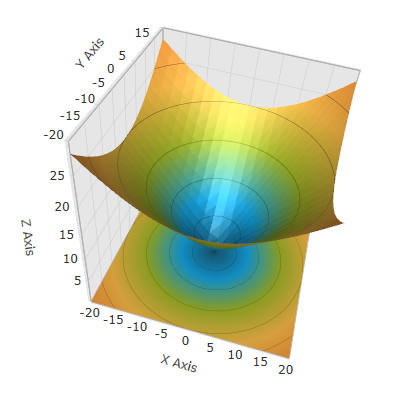

////

|metadata|
{
    "name": "surfacechart-getting-started-with-surfacechart",
    "controlName": ["{SurfaceChartName}"],
    "tags": [],
    "guid": "5f6c1c5a-af05-4af3-af4b-5c09f71531fb",  
    "buildFlags": ["wpf"],
    "createdOn": "2015-12-17T15:02:10.6907564Z"
}
|metadata|
////

= Adding Surface Chart 3D To Your Page

== Topic Overview

=== Purpose

This topic provides detailed instructions to help you get up and running as soon as possible with the link:{SurfaceChartLink}.xamscattersurface3d_members.html[XamScatterSurface3D]™ control.

=== Required background

The following topics are prerequisites to understanding this topic:

[options="header", cols="a,a"]
|====
|Topic|Purpose

| link:surfacechart-features-overview.html[Features Overview]
|This topic explains the features supported by the control from developer perspective.

| link:surfacechart-visual-elements.html[Visual Elements]
|This topic provides an overview of the visual elements of the control.

|====

=== In this topic

This topic contains the following sections:

* <<_Ref444182898, **Adding the Surface Chart 3D to Your Page – Example** >>

** <<_Ref444182946, Introduction >>
** <<_Preview, Preview >>
** <<_Prerequisites, Prerequisites>>
** <<_Overview, Overview >>
** <<_Ref444182962, Steps >>
** <<_Ref382317785, Full code >>

* <<_Ref444182909, **Related Content** >>

** <<_Ref444182912,Topics>>
** <<_Ref444182916,Samples>>

[[_Ref444182898]]
== Adding the Surface Chart 3D to Your Page – Example

[[_Ref444182946]]
=== Introduction

This example explains how to add a _xamScatterSurface3D_ control to your page and bind it to a set of data points.

[[_Preview]]
=== Preview

The following screenshot is a preview of the final result.

[[_Prerequisites]]
=== Prerequisites

To complete the procedure, you need the following:

* Create a Microsoft® WPF™ project and add the following assembly references: 

** {ApiPlatform}{SurfaceChartAssembly}.v{ProductVersion}
** {ApiPlatform}DataVisualization.v{ProductVersion} 
** {ApiPlatform}v{ProductVersion} 

* Add the following namespace declaration:

**In XAML:**

[source,xaml]
----
xmlns:ig="http://schemas.infragistics.com/xaml"
----

**In C#:**

[source,csharp]
----
using Infragistics.Controls.Charts;
----

**In Visual Basic:**

[source,vb]
----
Imports Infragistics.Controls.Charts
----

* Add the _xamSurfaceChart3D_ control to the page:

**In XAML:**

[source,xaml]
----
<ig:XamScatterSurface3D Name="SurfaceChart">
    <!-- ... -->
</ig:XamScatterSurface3D>
----

**In C#:**

[source,csharp]
----
var surfaceChart = new XamScatterSurface3D();
----

**In Visual Basic:**

[source,vb]
----
Dim surfaceChart = New XamScatterSurface3D()
----

[[_Overview]]
=== Overview

Following is a conceptual overview of the process:

* <<_Ref444183101, **Set the ItemsSource for the 3D Surface Chart**>> 
* <<_Ref444183122, **Set the XMemberPath, YMemberPath and ZMemberPath properties to create mappings between data model members and X, Y and Z locations**>> 
* <<_Ref444530102, **Define X, Y and Z axes (optional)**>>

[[_Ref444182962]]
=== Steps

The following steps demonstrate how to configure some basic options of the _xamScatterSurface3D_ control and bind it to a set of data points.

[[_Ref444183101]]
==== Set the ItemsSource for the 3D Surface Chart.

Set the ItemsSource for the 3D Surface Chart:

**In XAML:**

[source,xaml]
----
<ig:XamScatterSurface3D Name="SurfaceChart" 
    ItemsSource="{Binding Path=DataCollection}" …>
</ig:XamScatterSurface3D>
----

[[_Ref444183122]]
==== Set the XMemberPath, YMemberPath and ZMemberPath properties to create mappings between data model members and X, Y and Z locations

In this particular sample, the data model has three properties – X, Y and Z that holds location data that should be plotted.

Set the XMemberPath, YMemberPath and ZMemberPath properties to create mappings between data model members and X, Y and Z locations.

**In XAML:**

[source,xaml]
----
<ig:XamScatterSurface3D Name="SurfaceChart" 
    ItemsSource="{Binding Path=DataCollection}" 
    XMemberPath="X" YMemberPath="Y" ZMemberPath="Z">
</ig:XamScatterSurface3D>
----

[[_Ref444530102]]
==== Define X, Y and Z axes (optional)

Define X, Y and Z axes (optional):

**In XAML:**

[source,xaml]
----
<ig:XamScatterSurface3D Name="SurfaceChart" 
    ItemsSource="{Binding Path=DataCollection}"
    XMemberPath="X" YMemberPath="Y" ZMemberPath="Z">
    <ig:XamScatterSurface3D.XAxis>
        <ig:LinearAxis Title="X Axis" />
    </ig:XamScatterSurface3D.XAxis>
    <ig:XamScatterSurface3D.YAxis>
        <ig:LinearAxis Title="Y Axis" />
    </ig:XamScatterSurface3D.YAxis>
    <ig:XamScatterSurface3D.ZAxis>
        <ig:LinearAxis Title="Z Axis" />
    </ig:XamScatterSurface3D.ZAxis>
</ig:XamScatterSurface3D>
----

[[_Ref382317785]]
=== Full code

Following is the full code for this procedure.

**In C#:**

[source,csharp]
----
public class DataPoint
{
    public DataPoint() { }
    public DataPoint(double x, double y, double z)
    {
        this.X = x;
        this.Y = y;
        this.Z = z;
    }
    public double X { get; set; }
    public double Y { get; set; }
    public double Z { get; set; }
}
----

**In Visual Basic:**

[source,vb]
----
public Class DataPoint
Public Sub New()
End Sub
Public Sub New(x As Double, y As Double, z As Double)
    Me.X = x
    Me.Y = y
    Me.Z = z
End Sub
Private m_X As Double
Private m_Y As Double
Private m_Z As Double
Public Property X() As Double
    Get
      Return m_X
    End Get
    Set
        m_X = Value
    End Set
End Property
Public Property Y() As Double
    Get
        Return m_Y
    End Get
    Set
        m_Y = Value
    End Set
End Property
Public Property Z() As Double
    Get
        Return m_Z
    End Get
    Set
        m_Z = Value
    End Set
End Property
End Class
----

**In C#:**

[source,csharp]
----
public class ViewModel
{
    public List<DataPoint> DataCollection { get; set; }
    public ViewModel()
    {
        DataCollection = GenerateFormulaData();
    }
    internal static List<DataPoint> GenerateFormulaData()
    {
        var data = new List<DataPoint>();
        for (int x = -20; x <= 20; x += 2)
        {
            for (int y = -20; y <= 20; y += 2)
            {
                double z = Math.Sqrt(Math.Pow(x, 2) + Math.Pow(y, 2));
                var point = new DataPoint(x, y, z);
                data.Add(point);
            }
        }
        return data;
    }
}
----

**In Visual Basic:**

[source,vb]
----
Public Class ViewModel
    Public Property DataCollection() As List(Of DataPoint)
        Get
            Return m_DataCollection
        End Get
        Set
            m_DataCollection = Value
        End Set
    End Property
    Private m_DataCollection As List(Of DataPoint)
    Public Sub New()
        DataCollection = GenerateFormulaData()
    End Sub
    Friend Shared Function GenerateFormulaData() As List(Of DataPoint)
        Dim data = New List(Of DataPoint)()
        For x As Integer = -20 To 20 Step 2
            For y As Integer = -20 To 20 Step 2
                Dim z As Double = Math.Sqrt(Math.Pow(x, 2) + Math.Pow(y, 2))
                Dim point = New DataPoint(x, y, z)
                data.Add(point)
            Next
        Next
        Return data
    End Function
End Class
----

**In XAML:**

[source,xaml]
----
<Grid>
    <Grid.DataContext>
        <data:ViewModel />
    </Grid.DataContext>
    <ig:XamScatterSurface3D Name="SurfaceChart" 
        ItemsSource="{Binding Path=DataCollection}" 
        XMemberPath="X" YMemberPath="Y" ZMemberPath="Z">
        <ig:XamScatterSurface3D.XAxis>
            <ig:LinearAxis Title="X Axis" />
        </ig:XamScatterSurface3D.XAxis>
        <ig:XamScatterSurface3D.YAxis>
            <ig:LinearAxis Title="Y Axis" />
        </ig:XamScatterSurface3D.YAxis>
        <ig:XamScatterSurface3D.ZAxis>
            <ig:LinearAxis Title="Z Axis" />
        </ig:XamScatterSurface3D.ZAxis>
    </ig:XamScatterSurface3D>
</Grid>
----

**In C#:**

[source,csharp]
----
var surfaceChart = new XamScatterSurface3D();
surfaceChart.ItemsSource = new ViewModel().DataCollection;

surfaceChart.XMemberPath = "X";
surfaceChart.YMemberPath = "Y";
surfaceChart.ZMemberPath = "Z";

var xLinearAxis = new LinearAxis();
var yLinearAxis = new LinearAxis();
var zLinearAxis = new LinearAxis();

xLinearAxis.Title = "X Axis";
yLinearAxis.Title = "Y Axis";
zLinearAxis.Title = "Z Axis";

surfaceChart.XAxis = xLinearAxis;
surfaceChart.YAxis = yLinearAxis;
surfaceChart.ZAxis = zLinearAxis;
----

**In Visual Basic:**

[source,vb]
----
Dim surfaceChart = New XamScatterSurface3D()
surfaceChart.ItemsSource = New ViewModel().DataCollection

surfaceChart.XMemberPath = "X"
surfaceChart.YMemberPath = "Y"
surfaceChart.ZMemberPath = "Z"

Dim xLinearAxis = New LinearAxis()
Dim yLinearAxis = New LinearAxis()
Dim zLinearAxis = New LinearAxis()

xLinearAxis.Title = "X Axis"
yLinearAxis.Title = "Y Axis"
zLinearAxis.Title = "Z Axis"

surfaceChart.XAxis = xLinearAxis
surfaceChart.YAxis = yLinearAxis
surfaceChart.ZAxis = zLinearAxis
----

[[_Ref444182909]]
== Related Content

[[_Ref444182912]]
=== Topics

The following topics provide additional information related to this topic.

[options="header", cols="a,a"]
|====
|Topic|Purpose

| link:surfacechart-overview.html[Overview]
|The topics in this group provide you with an overview of the main features and visual elements of the _xamScatterSurface3D_ control.

| link:surfacechart-configuring-surfacechart.html[Configuring Surface Chart 3D]
|The topics in this section provide information about configuring different features in the _xamScatterSurface3D_ control.

| link:surfacechart-api-reference.html[API Reference]
|This topic provides reference information about the namespaces and classes related to the control.

|====

[[_Ref444182916]]
=== Samples

The following sample provides additional information related to this topic.

[options="header", cols="a,a"]
|====
|Sample|Purpose

| link:{SamplesURL}/surface-chart/basic-sample[First Look]
|This sample demonstrates some of the _xamScatterSurface3D_ key features as zooming, tooltip and crosshairs as well as surface colors configuration.

|====