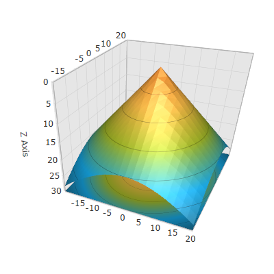

////

|metadata|
{
    "name": "surfacechart-inverting-axis",
    "controlName": ["{SurfaceChartName}"],
    "tags": [],
    "guid": "c2d77297-f098-40d0-9262-611c572763b6",  
    "buildFlags": ["wpf"],
    "createdOn": "2016-02-29T13:28:53.7712439Z"
}
|metadata|
////

= Inverting Axis

== Topic Overview

=== Purpose

This topic explains how to invert an axis in the link:{SurfaceChartLink}.xamscattersurface3d_members.html[XamScatterSurface3D]™ control.

=== Required background

The following topics are prerequisites to understanding this topic:

[options="header", cols="a,a"]
|====
|Topic|Purpose

| link:surfacechart-getting-started-with-surfacechart.html[Adding xamScatterSurface3D To Your Page]
|This topic provides detailed instructions to help you get up and running as soon as possible with the _xamScatterSurface3D_™ control.

| link:surfacechart-features-overview.html[Features Overview]
|This topic explains the features supported by the control from developer perspective.

| link:surfacechart-visual-elements.html[Visual Elements]
|This topic provides an overview of the visual elements of the control.

|====

=== In this topic

This topic contains the following sections:

* <<_Ref444008825, Inverting Axis >>
* <<_Ref444008830, Related Content >>

** <<_Ref444008833,Topics>>
** <<_Ref444008837,Samples>>

[[_Ref444008825]]
== Inverting Axis

=== Overview

Use the link:{SurfaceChartLink}.surfacechartaxis.html[SurfaceChartAxis] link:{SurfaceChartLink}.surfacechartaxis~isinverted.html[IsInverted] property to invert the specific axis in the  _xamScatterSurface3D_   control.

=== Property settings

The following table maps the desired configuration to the property settings that manage it.

[options="header", cols="a,a,a"]
|====
|In order to:|Use this property:|And set it to:

|Invert an axis
| link:{SurfaceChartLink}.surfacechartaxis~isinverted.html[IsInverted]
|`True`

|====

=== Example

The screenshot below demonstrates how the axis looks as a result of the following settings:

[options="header", cols="a,a"]
|====
|Property|Value

| link:{SurfaceChartLink}.surfacechartaxis~isinverted.html[IsInverted]
| _True_ 

|====

Following is the code that implements this example.

*In XAML:*

[source,xaml]
----
<ig:XamScatterSurface3D Name="SurfaceChart" 
    ItemsSource="{Binding Path=DataCollection}" 
    XMemberPath="X" YMemberPath="Y" ZMemberPath="Z">
    <ig:XamScatterSurface3D.ZAxis>
        <ig:LinearAxis Title="Z Axis" IsInverted="True" />
    </ig:XamScatterSurface3D.ZAxis>
</ig:XamScatterSurface3D>
----

*In C#:*

[source,csharp]
----
…
var linearAxis = new LinearAxis();
linearAxis.Title = "Z Axis";
linearAxis.IsInverted = true;
SurfaceChart.ZAxis = linearAxis;
----

*In Visual Basic:*

[source,vb]
----
…
Dim linearAxis = New LinearAxis()
linearAxis.Title = "Z Axis"
linearAxis.IsInverted = True
SurfaceChart.ZAxis = linearAxis
----

[[_Ref444008830]]
== Related Content

[[_Ref444008833]]

=== Topics

The following topics provide additional information related to this topic.

[options="header", cols="a,a"]
|====
|Topic|Purpose

| link:surfacechart-grid-lines.html[Configuring Axis Grid Lines]
|This topic explains how to configure the brush and thickness of the grid lines in the _xamScatterSurface3D_ control.

| link:surfacechart-configuring-axis-interval.html[Configuring Axis Interval]
|This topic explains how to configure the axis interval in the _xamScatterSurface3D_ control.

| link:surfacechart-configuring-axis-label.html[Configuring Axis Label]
|The topics in this group explain how to configure different aspects of the visual representation of the axis label in the _xamScatterSurface3D_ control.

| link:surfacechart-configuring-axis-line.html[Configuring Axis Line]
|This topic explains how to configure the axes lines in the _xamScatterSurface3D_ control.

| link:surfacechart-configuring-axis-range.html[Configuring Axis Range]
|This topic explains how to configure the axis range by setting the MinimumValue and MaximumValue properties in the _xamScatterSurface3D_ control.

| link:surfacechart-configuring-axis-scales.html[Configuring Axis Types]
|This topic explains the axis types available in the _xamScatterSurface3D_ control.

| link:surfacechart-configuring-axis-tick-marks-range.html[Configuring Axis Tick Marks Range]
|This topic explains how to configure the axis tick marks range in the _xamScatterSurface3D_ control.

| link:surfacechart-configuring-axis-title.html[Configuring Axis Title]
|The topics in this group explain how to configure different aspects of the visual representation of the axis title in the _xamScatterSurface3D_ control.

|====

[[_Ref444008837]]

=== Samples

The following sample provides additional information related to this topic.

[options="header", cols="a,a"]
|====
|Sample|Purpose

| link:{SamplesURL}/surface-chart/plotlines-sample[Plotlines Settings]
|This sample demonstrates how to configure the _xamScatterSurface3D_ grid and axes lines properties as well as line interval and axis inversion.

|====