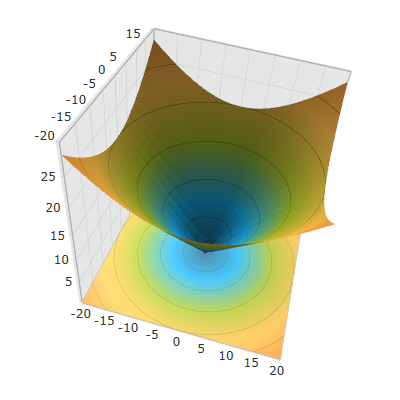
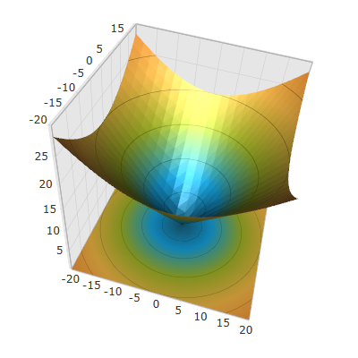
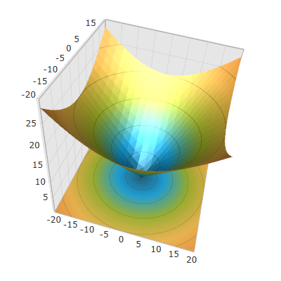

////

|metadata|
{
    "name": "surfacechart-light-settings",
    "controlName": ["{SurfaceChartName}"],
    "tags": [],
    "guid": "f89f855a-fab3-471b-9e33-37bc9099c6a3",  
    "buildFlags": ["wpf"],
    "createdOn": "2016-02-29T13:57:31.374241Z"
}
|metadata|
////

= Configuring Series Lighting

== Topic Overview

=== Purpose

This topic explains how to configure the light settings in the link:{SurfaceChartLink}.xamscattersurface3d_members.html[XamScatterSurface3D]™ control.

=== Required background

The following topics are prerequisites to understanding this topic:

[options="header", cols="a,a"]
|====
|Topic|Purpose

| link:surfacechart-getting-started-with-surfacechart.html[Adding xamScatterSurface3D To Your Page]
|This topic provides detailed instructions to help you get up and running as soon as possible with the _xamScatterSurface3D_™ control.

| link:surfacechart-features-overview.html[Features Overview]
|This topic explains the features supported by the control from developer perspective.

| link:surfacechart-visual-elements.html[Visual Elements]
|This topic provides an overview of the visual elements of the control.

|====

=== In this topic

This topic contains the following sections:

* <<_Ref444078615, Configuring Light Direction >>
* <<_Ref444078620, Configuring Light Intensity >>
* <<_Ref444078625, Configuring Shininess >>
* <<_Ref444078629, Related Content >>

** <<_Ref444078632,Topics>>
** <<_Ref444078635,Samples>>

[[_Ref444078615]]
== Configuring Light Direction

=== Overview

Use the link:{SurfaceChartLink}.xamscattersurface3d_members.html[XamScatterSurface3D] link:{SurfaceChartLink}.xamchart3d~lightdirection.html[LightDirection] property to specify the direction of the light that lights up the  _xamScatterSurface3D_   control.

=== Property settings

The following table maps the desired configuration to the property settings that manage it.

[options="header", cols="a,a,a"]
|====
|In order to:|Use this property:|And set it to:

|Specify the light direction
| link:{SurfaceChartLink}.xamchart3d~lightdirection.html[LightDirection]
|`Vector3D`

|====

=== Example

The screenshot below demonstrates how the  _xamScatterSurface3D_   control looks as a result of the following settings:

[options="header", cols="a,a"]
|====
|Property|Value

| link:{SurfaceChartLink}.xamchart3d~lightdirection.html[LightDirection]
| _0 -1 0_ 

|====

Following is the code that implements this example.

*In XAML:*

[source,xaml]
----
<ig:XamScatterSurface3D Name="SurfaceChart" 
 ItemsSource="{Binding Path=DataCollection}" 
 XMemberPath="X" YMemberPath="Y" ZMemberPath="Z" 
 LightDirection="0 -1 0" />
----

*In C#:*

[source,csharp]
----
SurfaceChart.LightDirection = new System.Windows.Media.Media3D.Vector3D(0, -1, 0);
----

*In Visual Basic:*

[source,vb]
----
SurfaceChart.LightDirection = New System.Windows.Media.Media3D.Vector3D(0, -1, 0)
----

[[_Ref444078620]]
== Configuring Light Intensity

=== Overview

Use the link:{SurfaceChartLink}.xamscattersurface3d_members.html[XamScatterSurface3D] link:{SurfaceChartLink}.xamchart3d~lightintensity.html[LightIntensity] property to specify the light intensity in the  _xamScatterSurface3D_   control.

=== Property settings

The following table maps the desired configuration to the property settings that manage it.

[options="header", cols="a,a,a"]
|====
|In order to:|Use this property:|And set it to:

|Specify the light intensity
| link:{SurfaceChartLink}.xamchart3d~lightintensity.html[LightIntensity]
|`double`

|====

=== Example

The screenshot below demonstrates how the  _xamScatterSurface3D_   control looks as a result of the following settings:

[options="header", cols="a,a"]
|====
|Property|Value

| link:{SurfaceChartLink}.xamchart3d~lightintensity.html[LightIntensity]
| _0.7_ 

|====

Following is the code that implements this example.

*In XAML:*

[source,xaml]
----
<ig:XamScatterSurface3D Name="SurfaceChart" 
 ItemsSource="{Binding Path=DataCollection}"  
 XMemberPath="X" YMemberPath="Y" ZMemberPath="Z" 
 LightIntensity="0.7"/>
----

*In C#:*

[source,csharp]
----
…
SurfaceChart.LightIntensity = 0.7;
----

*In Visual Basic:*

[source,vb]
----
…
SurfaceChart.LightIntensity = 0.7
----

[[_Ref444078625]]
== Configuring Shininess

=== Overview

Use the link:{SurfaceChartLink}.xamscattersurface3d_members.html[XamScatterSurface3D] link:{SurfaceChartLink}.xamscattersurface3d~shininess.html[Shininess] property to specify the series shininess in the  _xamScatterSurface3D_   control.

=== Property settings

The following table maps the desired configuration to the property settings that manage it.

[options="header", cols="a,a,a"]
|====
|In order to:|Use this property:|And set it to:

|Specify the series shininess
| link:{SurfaceChartLink}.xamscattersurface3d~shininess.html[Shininess]
|`double`

|====

=== Example

The screenshot below demonstrates how the  _xamScatterSurface3D_   control looks as a result of the following settings:

[options="header", cols="a,a"]
|====
|Property|Value

| link:{SurfaceChartLink}.xamscattersurface3d~shininess.html[Shininess]
| _0.9_ 

|====

Following is the code that implements this example.

*In XAML:*

[source,xaml]
----
<ig:XamScatterSurface3D Name="SurfaceChart" 
 ItemsSource="{Binding Path=DataCollection}" 
 XMemberPath="X" YMemberPath="Y" ZMemberPath="Z" 
 Shininess="0.9"/>
----

*In C#:*

[source,csharp]
----
…
SurfaceChart.Shininess = 0.9;
----

*In Visual Basic:*

[source,vb]
----
…
SurfaceChart.Shininess = 0.9
----

[[_Ref444078629]]
== Related Content

[[_Ref444078632]]

=== Topics

The following topics provide additional information related to this topic.

[options="header", cols="a,a"]
|====
|Topic|Purpose

| link:surfacechart-configuring-series-colors.html[Configuring Series Colors]
|This topic explains how to apply a custom color palette to the _xamScatterSurface3D_ control series as well as how to configure the colors interpolation.

| link:surfacechart-configuring-series-material.html[Configuring Series Material]
|This topic explains how to configure the material of the series of the _xamScatterSurface3D_ control.

| link:surfacechart-configuring-wireframe-material.html[Configuring Wireframe Material]
|This topic explains how to configure the material of the series wireframe of the _xamScatterSurface3D_ control.

| link:surfacechart-series-mouse-events.html[Series Mouse Events]
|This topic summarizes the series mouse events in the _xamScatterSurface3D_ control.

|====

[[_Ref444078635]]

=== Samples

The following sample provides additional information related to this topic.

[options="header", cols="a,a"]
|====
|Sample|Purpose

| link:{SamplesURL}/surface-chart/light-settings-sample[Light Settings]
|This sample demonstrates how to configure the light settings of the _xamScatterSurface3D_ control.

|====