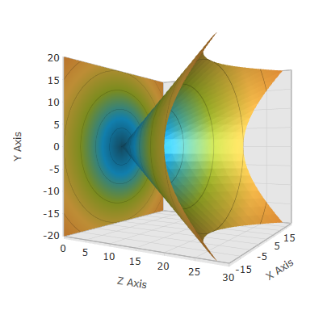

////
|metadata|
{
    "name": "surfacechart-rotation",
    "controlName": ["{SurfaceChartName}"],
    "tags": [],
    "guid": "95521e71-305e-44de-853c-bc6da83942b3",
    "buildFlags": ["wpf"],
    "createdOn": "2016-02-29T13:59:48.6542797Z"
}
|metadata|
////

= Rotation

== Topic Overview

=== Purpose

This topic explains how to configure the link:{SurfaceChartLink}.xamscattersurface3d_members.html[XamScatterSurface3D]™ control rotation using code.

=== Required background

The following topics are prerequisites to understanding this topic:

[options="header", cols="a,a"]
|====
|Topic|Purpose

| link:surfacechart-getting-started-with-surfacechart.html[Adding xamScatterSurface3D To Your Page]
|This topic provides detailed instructions to help you get up and running as soon as possible with the _xamScatterSurface3D_™ control.

| link:surfacechart-features-overview.html[Features Overview]
|This topic explains the features supported by the control from developer perspective.

| link:surfacechart-visual-elements.html[Visual Elements]
|This topic provides an overview of the visual elements of the control.

|====

The following table lists the external articles required as a prerequisite to understanding this topic.

[options="header", cols="a,a"]
|====
|Type|Content

|Concept
|*3-D rotation* 
|====

[options="header", cols="a,a"] 
|==== 

|Article|Purpose 

| link:https://msdn.microsoft.com/en-us/library/system.windows.media.media3d.rotation3d(v=vs.110).aspx[Rotation3D Class] 

|This articles describes how to use the abstract Rotation3D class in WPF. 

| link:https://msdn.microsoft.com/en-us/library/system.windows.media.media3d.axisanglerotation3d(v=vs.110).aspx[AxisAngleRotation3D Class] 

|This articles describes how to represent a 3-D rotation of a specified angle about a specified axis. 

| link:https://msdn.microsoft.com/en-us/library/system.windows.media.media3d.quaternionrotation3d(v=vs.110).aspx[QuaternionRotation3D Class] 

|This articles describes how to represent a rotation transformation defined as a quaternion. 

|==== 

=== In this topic

This topic contains the following sections:

* <<_Ref445738631, Configuring Rotation Specifying an Axis and Angle >>
* <<_Ref445738635, Configuring Rotation using Quaternion >>
* <<_Ref445738643, Related Content >>

** <<_Ref445738652,Topics>>
** <<_Ref445738656,Samples>>

[[_Ref445738631]]
== Configuring Rotation Specifying an Axis and Angle

=== Overview

Use the link:{SurfaceChartLink}.xamchart3d~rotation.html[Rotation] property to set rotation programmatically in the  _xamScatterSurface3D_   control.

Set the `Rotation` property to an `AxisAngleRotation3D` object with specified angle and axis of rotation.

=== Property settings

The following table maps the desired configuration to the property settings that manage it.

[options="header", cols="a,a,a"]
|====
|In order to:|Use this property:|And set it to:

|Perform rotation by specifying an axis and angle
| link:{SurfaceChartLink}.xamchart3d~rotation.html[Rotation]
|`AxisAngleRotation3D`

|====

=== Example

The screenshot below demonstrates how the  _xamScatterSurface3D_   control looks as a result of the following settings – 60 degrees rotation around the Y axis:

[options="header", cols="a,a"]
|====
|Property|Value

| link:{SurfaceChartLink}.xamchart3d~rotation.html[Rotation]
| _<AxisAngleRotation3D Angle="60" Axis="0 1 0" />_ 

|====

Following is the code that implements this example.

*In XAML:*

[source,xaml]
----
<ig:XamScatterSurface3D Name="SurfaceChart" 
 ItemsSource="{Binding Path=DataCollection}" 
 XMemberPath="X" YMemberPath="Y" ZMemberPath="Z">
    <ig:XamScatterSurface3D.Rotation>
        <AxisAngleRotation3D Angle="60" Axis="0 1 0" />
    </ig:XamScatterSurface3D.Rotation>
</ig:XamScatterSurface3D>
----

*In C#:*

[source,csharp]
----
var axis = new Vector3D(0, 1, 0);
var axisAngleRotation3D = new AxisAngleRotation3D(axis, 60);
SurfaceChart.Rotation = axisAngleRotation3D;
----

*In Visual Basic:*

[source,vb]
----
Dim axis = New Vector3D(0, 1, 0)
Dim axisAngleRotation3D = New AxisAngleRotation3D(axis, 60)
SurfaceChart.Rotation = axisAngleRotation3D
----

[[_Ref445738635]]
== Configuring Rotation using Quaternion

=== Overview

Use the link:{SurfaceChartLink}.xamchart3d~rotation.html[Rotation] property to set rotation programmatically in the  _xamScatterSurface3D_   control.

Set the `Rotation` property to a `QuaternionRotation3D` object that represents a rotation transformation defined as a quaternion.

If the rotation axes are named ax, ay and az and the angle of rotation is named theta, you can calculate the quaternion using the following formula:

The quaternion (x, y, z, w) is:

x = ax $$*$$ sin(theta/2)

y = ay $$*$$ sin(theta/2)

z = az $$*$$ sin(theta/2)

w = cos(theta/2)

So if you want to rotate the  _xamScatterSurface3D_   control around the Y axis and with angle of 60 degrees as the example above, the quaternion will be equal to (0, 0.5, 0, 0.866).

=== Property settings

The following table maps the desired configuration to the property settings that manage it.

[options="header", cols="a,a,a"]
|====
|In order to:|Use this property:|And set it to:

|Perform rotation using quaternion
| link:{SurfaceChartLink}.xamchart3d~rotation.html[Rotation]
|`QuaternionRotation3D`

|====

=== Example

The screenshot below demonstrates how the  _xamScatterSurface3D_   control looks as a result of the following code:

Following is the code that implements this example.

*In XAML:*

[source,xaml]
----
<ig:XamScatterSurface3D Name="SurfaceChart" 
 ItemsSource="{Binding Path=DataCollection}" 
 XMemberPath="X" YMemberPath="Y" ZMemberPath="Z">
    <ig:XamScatterSurface3D.Rotation>
        <QuaternionRotation3D Quaternion="0, 0.5, 0, 0.866" />
    </ig:XamScatterSurface3D.Rotation>
</ig:XamScatterSurface3D>
----

*In C#:*

[source,csharp]
----
…
var quaternion = new Quaternion();
quaternion.X = 0;
quaternion.Y = 0.5;
quaternion.Z = 0;
quaternion.W = 0.866;
var quaternionRotation3D = new QuaternionRotation3D();
quaternionRotation3D.Quaternion = quaternion;
SurfaceChart.Rotation = quaternionRotation3D;
----

*In Visual Basic:*

[source,vb]
----
…
Dim quaternion = New Quaternion()
quaternion.X = 0
quaternion.Y = 0.5
quaternion.Z = 0
quaternion.W = 0.866
Dim quaternionRotation3D = New QuaternionRotation3D()
quaternionRotation3D.Quaternion = quaternion
SurfaceChart.Rotation = quaternionRotation3D
----

[[_Ref445738643]]

== Related Content

[[_Ref445738652]]

=== Topics

The following topics provide additional information related to this topic.

[options="header", cols="a,a"]
|====
|Topic|Purpose

| link:surfacechart-aspect-perspective.html[Aspect and Perspective]
|This topic explains how to configure the aspect and perspective of the _xamScatterSurface3D_ control.

| link:surfacechart-axis.html[Axis Settings]
|The topics in this group explain how to configure different axis settings in the _xamScatterSurface3D_ control.

| link:surfacechart-crosshairs.html[Crosshairs Settings]
|This topic explains how to configure to the crosshairs in the _xamScatterSurface3D_ control.

| link:surfacechart-cube.html[Cube Settings]
|This topic explains how to configure the rim thickness and the material of the cube of the _xamScatterSurface3D_ control.

| link:surfacechart-data-point-marker.html[Data Point Markers]
|The topics in this group explain how to configure the data point markers in the _xamScatterSurface3D_ control.

| link:surfacechart-floor.html[Floor Settings]
|This topic explains how to configure the floor settings of the _xamScatterSurface3D_ control.

| link:surfacechart-performance.html[Performance]
|This topic explains how the _xamScatterSurface3D_ control performance can be optimized when rendering a large set of data points.

| link:surfacechart-series.html[Series Settings]
|The topics in this group explain how to configure different series settings in the _xamScatterSurface3D_ control.

| link:surfacechart-tooltip.html[Tooltip]
|This topic explains how to show/hide the default tooltip and how apply a custom tooltip using DataTemplate in the _xamScatterSurface3D_ control.

| link:surfacechart-zooming.html[Zooming]
|This topic explains how to perform the scaling of the _xamScatterSurface3D_ control.

|====