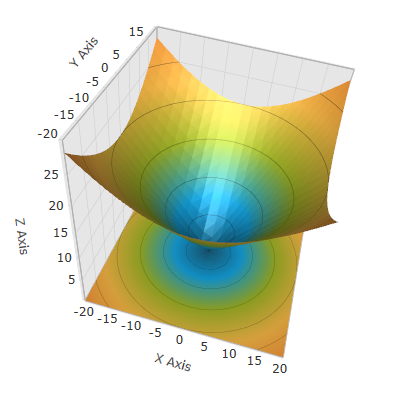

////

|metadata|
{
    "name": "surfacechart-setting-axis-title",
    "controlName": ["{SurfaceChartName}"],
    "tags": [],
    "guid": "3415f277-2ffd-4ae1-900a-05be93d71763",  
    "buildFlags": ["wpf"],
    "createdOn": "2016-03-01T19:53:54.2985007Z"
}
|metadata|
////

= Setting Axis Title

== Topic Overview

=== Purpose

This topic explains how to set axis title in the link:{SurfaceChartLink}.xamscattersurface3d_members.html[XamScatterSurface3D]™ control.

=== Required background

The following topics are prerequisites to understanding this topic:

[options="header", cols="a,a"]
|====
|Topic|Purpose

| link:surfacechart-getting-started-with-surfacechart.html[Adding xamScatterSurface3D To Your Page]
|This topic provides detailed instructions to help you get up and running as soon as possible with the _xamScatterSurface3D_™ control.

| link:surfacechart-features-overview.html[Features Overview]
|This topic explains the features supported by the control from developer perspective.

| link:surfacechart-visual-elements.html[Visual Elements]
|This topic provides an overview of the visual elements of the control.

|====

=== In this topic

This topic contains the following sections:

* <<_Ref444633449, Setting Axis Title >>
* <<_Ref444633455, Related Content >>

** <<_Ref444633460,Topics>>
** <<_Ref444633465,Samples>>

[[_Ref444633449]]
== Setting Axis Title

=== Overview

Use the link:{SurfaceChartLink}.surfacechartaxis.html[SurfaceChartAxis] link:{SurfaceChartLink}.surfacechartaxis~title.html[Title] property to set an axis title.

By default, the axes are not named.

=== Property settings

The following table maps the desired configuration to the property settings that manage it.

[options="header", cols="a,a,a"]
|====
|In order to:|Use this property:|And set it to:

|Set an axis title
| link:{SurfaceChartLink}.surfacechartaxis~title.html[Title]
|`string`

|====

=== Example

The screenshot below demonstrates an example setting the  _xamScatterSurface3D_   control axes titles:

Following is the code that implements this example.

*In XAML:*

[source,xaml]
----
<ig:XamScatterSurface3D Name="SurfaceChart" 
 ItemsSource="{Binding Path=DataCollection}" 
 XMemberPath="X" YMemberPath="Y" ZMemberPath="Z">
    <ig:XamScatterSurface3D.XAxis>
        <ig:LinearAxis Title="X Axis" />
    </ig:XamScatterSurface3D.XAxis>
    <ig:XamScatterSurface3D.YAxis>
        <ig:LinearAxis Title="Y Axis" />
    </ig:XamScatterSurface3D.YAxis>
    <ig:XamScatterSurface3D.ZAxis>
        <ig:LinearAxis Title="Z Axis" />
    </ig:XamScatterSurface3D.ZAxis>
</ig:XamScatterSurface3D>
----

*In C#:*

[source,csharp]
----
var linearAxisX = new LinearAxis();
var linearAxisY = new LinearAxis();
var linearAxisZ = new LinearAxis();
linearAxisX.Title = "X Axis";
linearAxisY.Title = "Y Axis";
linearAxisZ.Title = "Z Axis";
SurfaceChart.XAxis = linearAxisX;
SurfaceChart.YAxis = linearAxisY;
SurfaceChart.ZAxis = linearAxisZ;
----

*In Visual Basic:*

[source,vb]
----
Dim linearAxisX = New LinearAxis()
Dim linearAxisY = New LinearAxis()
Dim linearAxisZ = New LinearAxis()
linearAxisX.Title = "X Axis"
linearAxisY.Title = "Y Axis"
linearAxisZ.Title = "Z Axis"
SurfaceChart.XAxis = linearAxisX
SurfaceChart.YAxis = linearAxisY
SurfaceChart.ZAxis = linearAxisZ
----

[[_Ref444633455]]
== Related Content

[[_Ref444633460]]

=== Topics

The following topics provide additional information related to this topic.

[options="header", cols="a,a"]
|====
|Topic|Purpose

| link:surfacechart-configuring-axis-title-color-settings.html[Configuring Axis Title Color Settings]
|This topic explains how to configure the axis title background and foreground brush in the _xamScatterSurface3D_ control.

| link:surfacechart-configuring-axis-title-font-settings.html[Configuring Axis Title Font Settings]
|This topic explains how to configure the axis title font settings in the _xamScatterSurface3D_ control.

| link:surfacechart-configuring-axis-title-offset.html[Configuring Axis Title Offset]
|This topic explains how to configure the title offset from its axis in the _xamScatterSurface3D_ control.

| link:surfacechart-configuring-axis-title-visibility-settings.html[Configuring Axis Title Visibility Settings]
|This topic explains how to configure the axis title visibility and opacity in the _xamScatterSurface3D_ control.

| link:surfacechart-axis-title-templating.html[Axis Title Templating]
|This topic explains how to re-template the axis title in the _xamScatterSurface3D_ control.

|====

[[_Ref444633465]]

=== Samples

The following samples provide additional information related to this topic.

[options="header", cols="a,a"]
|====
|Sample|Purpose

| link:{SamplesURL}/surface-chart/axes-titles-sample[Axes Titles]
|This sample demonstrates how to customize the _xamScatterSurface3D_ control axes titles settings.

|====