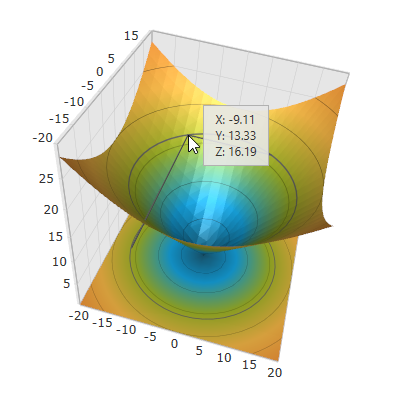
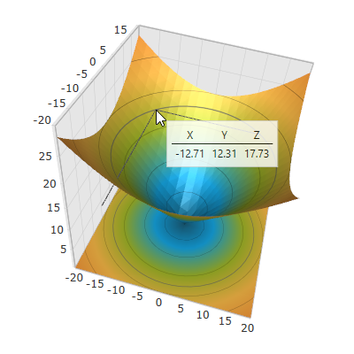

////

|metadata|
{
    "name": "surfacechart-tooltip",
    "controlName": ["{SurfaceChartName}"],
    "tags": [],
    "guid": "30bf8c74-7695-483d-9084-a7d5f2483a52",  
    "buildFlags": ["wpf"],
    "createdOn": "2016-02-29T14:00:43.6141694Z"
}
|metadata|
////

= Tooltip

== Topic Overview

=== Purpose

This topic explains how to show/hide the default tooltip and how apply a custom tooltip using DataTemplate in the link:{SurfaceChartLink}.xamscattersurface3d_members.html[XamScatterSurface3D]™ control.

=== Required background

The following topics are prerequisites to understanding this topic:

[options="header", cols="a,a"]
|====
|Topic|Purpose

| link:surfacechart-getting-started-with-surfacechart.html[Adding xamScatterSurface3D To Your Page]
|This topic provides detailed instructions to help you get up and running as soon as possible with the _xamScatterSurface3D_™ control.

| link:surfacechart-features-overview.html[Features Overview]
|This topic explains the features supported by the control from developer perspective.

| link:surfacechart-visual-elements.html[Visual Elements]
|This topic provides an overview of the visual elements of the control.

|====

=== In this topic

This topic contains the following sections:

* <<_Ref443077597, Showing/Hiding the Default Tooltip >>
* <<_Ref443077603, Applying a Custom Tooltip >>
* <<_Ref443077611, Related Content >>

** <<_Ref443077615,Topics>>
** <<_Ref443077619,Samples>>

[[_Ref443077597]]
== Showing/Hiding the Default Tooltip

=== Overview

A 2D tooltip is displayed as long as you mouse hover over the  _xamScatterSurface3D_   series surface to provide information about X, Y and Z data points coordinates.

Use the link:{SurfaceChartLink}.xamscattersurface3d_members.html[XamScatterSurface3D] link:{SurfaceChartLink}.xamchart3d~tooltipvisibility.html[ToolTipVisibility] property to show/hide the default tooltip in the  _xamScatterSurface3D_   control.

By default, the initial value of the `ToolTipVisibility` is `Visible`.

=== Property settings

The following table maps the desired configuration to the property settings that manage it.

[options="header", cols="a,a,a"]
|====
|In order to:|Use this property:|And set it to:

|Show/hide the default tooltip
| link:{SurfaceChartLink}.xamchart3d~tooltipvisibility.html[ToolTipVisibility]
|`Visibility`

|====

=== Example

The screenshot below demonstrates how the  _xamScatterSurface3D_   control behaves as a result of the following settings:

[options="header", cols="a,a"]
|====
|Property|Value

| link:{SurfaceChartLink}.xamchart3d~tooltipvisibility.html[ToolTipVisibility]
| _Visible_ 

|====

Following is the code that implements this example.

*In XAML:*

[source,xaml]
----
<ig:XamScatterSurface3D Name="SurfaceChart" 
 ItemsSource="{Binding Path=DataCollection}" 
 XMemberPath="X" YMemberPath="Y" ZMemberPath="Z" 
 ToolTipVisibility="Visible"/>
----

*In C#:*

[source,csharp]
----
…
SurfaceChart.ToolTipVisibility = Visibility.Visible;
----

*In Visual Basic:*

[source,vb]
----
…
SurfaceChart.ToolTipVisibility = Visibility.Visible
----

[[_Ref443077603]]
== Applying a Custom Tooltip

=== Overview

Use the link:{SurfaceChartLink}.xamscattersurface3d_members.html[XamScatterSurface3D] link:{SurfaceChartLink}.xamchart3d~tooltiptemplate.html[ToolTipTemplate] property to apply a custom tooltip DataTemplate to the  _xamScatterSurface3D_   control in order to change its visual appearance.

The runtime `DataContext` of the created `DataTemplate` is a link:{SurfaceChartLink}.surfacecharttooltipdatacontext_members.html[SurfaceChartToolTipDataContext] object.

The `SurfaceChartToolTipDataContext` provides a property link:{SurfaceChartLink}.surfacecharttooltipdatacontext~location.html[Location] of type `Point3D` corresponding to the mouse location in 3D space.

Use negative container margins to arrange the tooltip above or left of the mouse location.

=== Property settings

The following table maps the desired configuration to the property settings that manage it.

[options="header", cols="a,a,a"]
|====
|In order to:|Use this property:|And set it to:

|Apply a custom tooltip
| link:{SurfaceChartLink}.xamchart3d~tooltiptemplate.html[ToolTipTemplate]
|`DataTemplate`

|====

=== Example

The screenshot below demonstrates how the  _xamScatterSurface3D_   control looks as a result of the following settings:

Following is the code that implements this example.

*In XAML:*

[source,xaml]
----
<Grid>
    <Grid.Resources>
        
        
        <DataTemplate x:Key="ToolTipTemplate">
            <Border BorderBrush="LightGray" BorderThickness="1" Margin="12" Padding="5" Background="White" Opacity="0.8" >
                <Grid>
                    <Grid.ColumnDefinitions>
                        <ColumnDefinition/>
                        <ColumnDefinition/>
                        <ColumnDefinition/>
                    </Grid.ColumnDefinitions>
                    <Grid.RowDefinitions>
                        <RowDefinition/>
                        <RowDefinition/>
                        <RowDefinition/>
                    </Grid.RowDefinitions>
                    <TextBlock Text="X" Grid.Column="0" Grid.Row="0" Style="{StaticResource HeaderTextBlockStyle}"/>
                    <TextBlock Text="Y" Grid.Column="1" Grid.Row="0" Style="{StaticResource HeaderTextBlockStyle}"/>
                    <TextBlock Text="Z" Grid.Column="2" Grid.Row="0" Style="{StaticResource HeaderTextBlockStyle}"/>
                    <Border BorderBrush="Black" BorderThickness="0.5" HorizontalAlignment="Stretch" Grid.Row="1" Grid.ColumnSpan="3"/>
                    <TextBlock Text="{Binding Location.X, StringFormat=N2}" Grid.Column="0" Grid.Row="2" Style="{StaticResource TextBlockStyle}" />
                    <TextBlock Text="{Binding Location.Y, StringFormat=N2}" Grid.Column="1" Grid.Row="2" Style="{StaticResource TextBlockStyle}"/>
                    <TextBlock Text="{Binding Location.Z, StringFormat=N2}" Grid.Column="2" Grid.Row="2" Style="{StaticResource TextBlockStyle}"/>
                </Grid>
            </Border>
        </DataTemplate>
    </Grid.Resources>
    <ig:XamScatterSurface3D Name="SurfaceChart" 
 ItemsSource="{Binding Path=DataCollection}" 
 XMemberPath="X" YMemberPath="Y" ZMemberPath="Z" 
 ToolTipTemplate="{StaticResource ToolTipTemplate}"/>
</Grid>
----

[[_Ref443077611]]
== Related Content

[[_Ref443077615]]

=== Topics

The following topics provide additional information related to this topic.

[options="header", cols="a,a"]
|====
|Topic|Purpose

| link:surfacechart-aspect-perspective.html[Aspect and Perspective]
|This topic explains how to configure the aspect and perspective of the _xamScatterSurface3D_ control.

| link:surfacechart-axis.html[Axis Settings]
|The topics in this group explain how to configure different axis settings in the _xamScatterSurface3D_ control.

| link:surfacechart-crosshairs.html[Crosshairs Settings]
|This topic explains how to configure to the crosshairs in the _xamScatterSurface3D_ control.

| link:surfacechart-cube.html[Cube Settings]
|This topic explains how to configure the rim thickness and the material of the cube of the _xamScatterSurface3D_ control.

| link:surfacechart-data-point-marker.html[Data Point Markers]
|The topics in this group explain how to configure the data point markers in the _xamScatterSurface3D_ control.

| link:surfacechart-floor.html[Floor Settings]
|This topic explains how to configure the floor settings of the _xamScatterSurface3D_ control.

| link:surfacechart-performance.html[Performance]
|This topic explains how the _xamScatterSurface3D_ control performance can be optimized when rendering a large set of data points.

| link:surfacechart-rotation.html[Rotation]
|This topic explains how to configure the _xamScatterSurface3D_ control rotation using code.

| link:surfacechart-series.html[Series Settings]
|The topics in this group explain how to configure different series settings in the _xamScatterSurface3D_ control.

| link:surfacechart-zooming.html[Zooming]
|This topic explains how to perform the scaling of the _xamScatterSurface3D_ control.

|====

[[_Ref443077619]]

=== Samples

The following sample provides additional information related to this topic.

[options="header", cols="a,a"]
|====
|Sample|Purpose

| link:{SamplesURL}/surface-chart/tooltip-sample[Tooltip Template]
|This sample demonstrates how to create a custom tooltip in the _xamScatterSurface3D_ control using the TooltipTemplate property.

|====