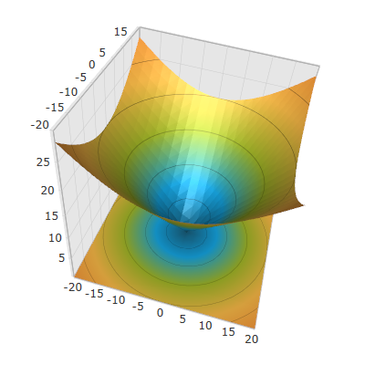

////

|metadata|
{
    "name": "xamscattersurface3d",
    "controlName": ["{SurfaceChartName}"],
    "tags": [],
    "guid": "a7e314af-402a-46e5-b983-efcc10db570e",  
    "buildFlags": ["wpf"],
    "createdOn": "2015-12-17T15:01:05.0951888Z"
}
|metadata|
////

= {SurfaceChartName}

== In This Group of Topics

=== Introduction

This section contains topics covering the link:{SurfaceChartLink}.xamscattersurface3d_members.html[XamScatterSurface3D]™ control for WPF.

The  _xamScatterSurface3D_   control allows fast, visually appealing and customizable three-dimensional surface visualization. The control offers a full set of API options to achieve any 3D surface plotting requirement and very intuitive default values to minimize the coding required.

The following screenshot shows the default look of the  _xamScatterSurface3D_   control:

=== Topics

[options="header", cols="a,a"]
|====
|Topic|Purpose

| link:surfacechart-overview.html[Overview]
|The topics in this group provide you with an overview of the control.

| link:surfacechart-getting-started-with-surfacechart.html[Adding Surface Chart 3D To Your Page]
|This topic provides detailed instructions to help you get up and running as soon as possible with the control.

| link:surfacechart-configuring-surfacechart.html[Configuring Surface Chart 3D]
|The topics in this section provide information about configuring the control.

| link:surfacechart-api-reference.html[API Reference]
|This topic provides reference information about the namespaces and classes related to the control.

|====